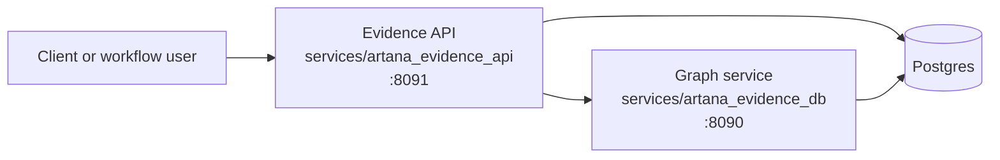
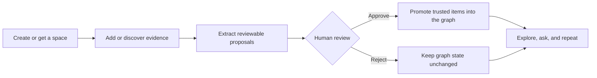

# Artana Evidence Platform

`artana-evidence-platform` is the backend home for Artana's evidence workflow:
an Evidence API plus a governed graph/evidence service. It is designed to run
as an independent project with its own local setup, service contracts,
migrations, tests, and operational checks.

The platform is intentionally backend-only. Product apps, notebooks, SDKs, and
other clients integrate through the generated OpenAPI contracts instead of
living inside this repository.

## Repository Layout

- `services/artana_evidence_api`: the Evidence API for research spaces, local
  identity, document ingestion, PubMed/MARRVEL discovery, review queues,
  proposals, graph chat/search orchestration, guarded AI runs, and user-facing
  workflow state.
- `services/artana_evidence_db`: the graph/evidence service for entities,
  relations, observations, provenance, relation evidence, dictionary
  governance, validation, graph views, and graph service API contracts.
- `docs/`: architecture notes, user guides, project status, remaining work, and
  operating guidance.
- `scripts/`: repository checks, contract helpers, and local automation.
- `tests/`: repository-level regression and boundary tests that do not belong
  to one service tree. Service-specific tests live under each service.

Keep workflow orchestration in `services/artana_evidence_api`. Keep graph
persistence, dictionary governance, graph validation, and evidence/provenance
contracts in `services/artana_evidence_db`.

## System Shape



The Evidence API is the public workflow surface. It handles authentication,
spaces, ingestion, review queues, proposals, run state, and AI orchestration.
The graph service is the governed evidence system. It handles graph entities,
relations, dictionary rules, provenance, validation, and graph contracts.

## Client Integration

Current backend contracts live in the generated OpenAPI and TypeScript contract
files listed below. New clients should treat those files, plus the user guide
and endpoint index, as the integration surface.

- [User Guide](docs/user-guide/README.md)
- [Endpoint Index](docs/user-guide/09-endpoint-index.md)
- `services/artana_evidence_api/openapi.json`
- `services/artana_evidence_db/openapi.json`
- `services/artana_evidence_db/artana-evidence-db.generated.ts`

The Evidence API currently publishes OpenAPI only. TypeScript clients should
generate from `services/artana_evidence_api/openapi.json`; the checked-in
TypeScript artifact is specific to the graph service. If dedicated product,
SDK, or notebook repositories are created, link them here as client projects
rather than adding them to this backend repository.

## Start Locally

Prerequisites:

- Python 3.13 or newer.
- Docker with Compose support for the local Postgres container.
- A shell that can run the repo `Makefile` targets.

```bash
make install-dev
make run-all
```

`make run-all` starts local Postgres, the graph service on
`http://127.0.0.1:8090`, and the Evidence API on `http://127.0.0.1:8091`.
It also applies the required schemas and service migrations through
`make setup-postgres`.

On first run, the Makefile creates `.env.postgres` from
`.env.postgres.example` if needed. Keep production secrets out of this local
file; deployed environments must provide their own JWT and database settings.

Container note: `docker-compose.postgres.yml` starts Postgres for local
development. Each service also has its own Dockerfile for runtime/test images.
Use `make run-all` for the local two-service development stack.

After `make run-all` is ready, verify the local Evidence API from another
terminal:

```bash
curl http://127.0.0.1:8091/health
```

## Docs

- [Docs Index](docs/README.md)
- [Current System](docs/architecture/current-system.md)
- [User Guide](docs/user-guide/README.md)
- [Project Status](docs/project_status.md)
- [Engineering Plan](docs/plan.md)
- [Remaining Work](docs/remaining_work_priorities.md)

## Main Workflow



The review queue is the trust gate. AI workflows can search, extract, and stage
work, but promoted graph state should flow through review/governance.

## Service Gates

Run these before merging backend changes:

```bash
make all
make service-checks
make graph-service-checks
make artana-evidence-api-service-checks
```

`make all` is an alias for `make service-checks`, the normal CI gate. It runs
lint, type checks, architecture checks, contract checks, isolated Postgres
tests, and coverage.
Live/external tests are not required for normal CI; they skip with explicit
messages unless their environment variables or local services are available.

The graph service lives in `services/artana_evidence_db`; its Makefile targets
use the `graph-service-*` prefix. The Evidence API lives in
`services/artana_evidence_api`; its Makefile targets use the
`artana-evidence-api-*` prefix.

Useful focused checks:

```bash
make graph-service-contract-check
make artana-evidence-api-contract-check
make graph-service-boundary-check
make artana-evidence-api-boundary-check
make graph-phase6-release-check
```

## Live Checks

Run these only when you intentionally want to hit running local services or
public external APIs.

For the live local endpoint contract, start the stack in one terminal:

```bash
make run-all
```

Then run:

```bash
make live-endpoint-contract-check
```

For live PubMed, ClinVar, AlphaFold, MONDO, and related integration checks:

```bash
make live-external-api-check
```

To run both live groups, keep `make run-all` running and execute:

```bash
make live-service-checks
```

## Generated Contracts

- `services/artana_evidence_api/openapi.json`
- `services/artana_evidence_db/openapi.json`
- `services/artana_evidence_db/artana-evidence-db.generated.ts`

Regenerate graph artifacts with:

```bash
make graph-service-sync-contracts
```

Regenerate Evidence API OpenAPI with:

```bash
make artana-evidence-api-openapi
```
