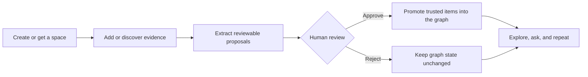

# Artana Evidence Platform

Status date: April 23, 2026.

`artana-evidence-platform` is the extracted backend repo for the Artana
evidence services.

This checkout currently contains:

- `services/artana_evidence_api`: Evidence API, local identity gateway,
  documents, proposals, review queue, research-init, chat, and AI workflow
  runtimes.
- `services/artana_evidence_db`: governed graph service, dictionary, claims,
  relations, observations, provenance, graph views, workflows, and graph admin
  sync.

This checkout does not contain:

- a frontend app;
- the old top-level `src` runtime package;
- `packages/artana_api`;
- unrelated monorepo services.

## Surfaces Outside This Repo

This repository is intentionally backend-only. Product clients should integrate
through the Evidence API OpenAPI contract while the frontend and public SDK
decision remains outside this checkout.

- Current backend contracts live in the generated OpenAPI files listed below.
- If a frontend or SDK repository is created, link it here rather than
  reintroducing UI or SDK packages into this backend repo.
- Until then, use the [User Guide](docs/user-guide/README.md) and
  [Endpoint Index](docs/user-guide/09-endpoint-index.md) for API onboarding.

## Start Locally

Prerequisites:

- Python 3.13 or newer.
- Docker with Compose support for the local Postgres container.
- A shell that can run the repo `Makefile` targets.

```bash
make install-dev
make run-all
```

`make run-all` starts local Postgres, the graph service on
`http://127.0.0.1:8090`, and the Evidence API on `http://127.0.0.1:8091`.
It also applies the required schemas and service migrations through
`make setup-postgres`.

On first run, the Makefile creates `.env.postgres` from
`.env.postgres.example` if needed. Keep production secrets out of this local
file; deployed environments must provide their own JWT and database settings.

Container note: `docker-compose.postgres.yml` starts Postgres for local
development, and each service has its own Dockerfile for runtime/test images.
There is not currently a root full-stack `docker-compose.yml` for Postgres plus
both Python services.

After `make run-all` is ready, verify the local Evidence API from another
terminal:

```bash
curl http://127.0.0.1:8091/health
```

## Docs

- [Docs Index](docs/README.md)
- [Current System](docs/architecture/current-system.md)
- [User Guide](docs/user-guide/README.md)
- [Project Status](docs/project_status.md)
- [Engineering Plan](docs/plan.md)
- [Remaining Work](docs/remaining_work_priorities.md)

## Main Workflow



The review queue is the trust gate. AI workflows can search, extract, and stage
work, but promoted graph state should flow through review/governance.

## Service Gates

Run these before merging backend changes:

```bash
make all
make service-checks
make graph-service-checks
make artana-evidence-api-service-checks
```

`make all` is an alias for `make service-checks`, the normal CI gate. It runs lint, type checks,
architecture checks, contract checks, isolated Postgres tests, and coverage.
Live/external tests are not required for normal CI; they skip with explicit
messages unless their environment variables or local services are available.

Useful focused checks:

```bash
make graph-service-contract-check
make artana-evidence-api-contract-check
make graph-service-boundary-check
make artana-evidence-api-boundary-check
make graph-phase6-release-check
```

## Live Checks

Run these only when you intentionally want to hit running local services or
public external APIs.

For the live local endpoint contract, start the stack in one terminal:

```bash
make run-all
```

Then run:

```bash
make live-endpoint-contract-check
```

For live PubMed, ClinVar, AlphaFold, MONDO, and related integration checks:

```bash
make live-external-api-check
```

To run both live groups, keep `make run-all` running and execute:

```bash
make live-service-checks
```

## Generated Contracts

- `services/artana_evidence_api/openapi.json`
- `services/artana_evidence_db/openapi.json`
- `services/artana_evidence_db/artana-evidence-db.generated.ts`

Regenerate graph artifacts with:

```bash
make graph-service-sync-contracts
```

Regenerate Evidence API OpenAPI with:

```bash
make artana-evidence-api-openapi
```
