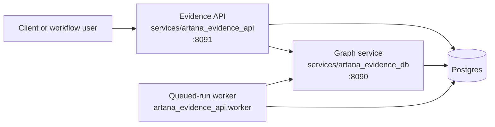
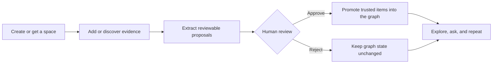

# Artana Evidence Platform

Artana is infrastructure that turns machine reading into **governed scientific
knowledge**: every claim traceable to an exact source, preserved with the
context that makes it meaningful, aggregated only under explicit and versioned
rules, and accountable to named human judgment.

The central conviction, and the thing that shapes every boundary in this repo:

> **LLMs propose. The system governs.**

The language model is the *reading* layer — fast, broad, and wrong often enough
that its output can never be authoritative on its own. Everything in this
repository is the *knowing* layer around it: source custody, preserved
qualifiers, server-owned verification, explicit merge rules, and attributed
human review. A better extractor makes that substrate more productive; it
cannot substitute for it.

The full framing is in
[Vision and Direction (v2.0)](docs/artana-vision-and-direction.md), which is
authoritative for *why* the system is shaped this way.

This repository is the backend home for that work: an Evidence API plus a
governed graph/evidence service. It runs as an independent project with its own
local setup, service contracts, migrations, tests, and operational checks, and
it is intentionally backend-only. Product apps, notebooks, SDKs, and other
clients integrate through the generated OpenAPI contracts instead of living
here.

## Status

Status date: **July 30, 2026.** This section is the honest read, not a roadmap.

The substrate is largely built. Governance defects called out in the July
direction review have been closed one at a time, and the reviewer surface
exists. The end-to-end AI-authored path is **deliberately fail-closed** and not
yet measurable.

| Capability | Plain statement | State |
| --- | --- | --- |
| **READ** | Given one document's text, find the claims in it. | Runs; measurable. |
| **GROUND** | Bind each claim to an exact span, with a receipt someone else can check. | Runs; emitted offsets are absolute and comparable to gold. |
| **CONNECT** | Recognize an entity across papers; end with one node supported by five papers, not five nodes. | **Not measurable end-to-end on the AI-authored path.** |

Why CONNECT is blocked, precisely — these are verified facts in the tree, not
estimates:

- **AI-authored claim persistence is quarantined.** Promotion of an
  agent-authored qualified claim returns HTTP 409
  `qualified_claim_persistence_not_ready`
  ([proposal_actions.py](services/artana_evidence_api/proposal_actions.py:843),
  enforced graph-side by
  [ai_persistence_quarantine.py](services/artana_evidence_db/validation/ai_persistence_quarantine.py)).
  The graph contract cannot yet persist a complete `ClaimFrame` without loss,
  so it refuses rather than dropping qualifiers.
- **Cross-document claim identity is zero by construction** while the claim
  de-duplication key includes the source span — a span from paper A can never
  equal a span from paper B.
- The **human/curator-authored path is not inert**: those claims do resolve into
  canonical relations and read back correctly. The wall is specific to claims
  marked agent-authored.

The measurement plan that establishes all of the above, including what it costs
to close, is
[Validating READ, GROUND, CONNECT](docs/validation/2026-07-25-product-validation-read-ground-connect.md).

### What has landed recently

- **Server-owned support semantics** — claim support is no longer derived from
  caller-supplied metadata.
- **No silent loss** — colliding proposals are retained instead of dropped.
- **Attributed human judgment** — automated promotion and human review are
  separate paths, and the deciding reviewer is persisted rather than discarded
  ([ReviewActor](services/artana_evidence_api/types/review_actor.py)).
- **Honest evidence strength** — corroboration counts distinct documents.
- **Trust ladder** — extracted candidates are tiered by hard floors the service
  computes, never by caller assertion
  ([trust_ladder.py](services/artana_evidence_api/document_extraction_support/trust_ladder.py)).
- **Reproducible model attempts** — every attempt records a request digest, the
  formal-run model is named explicitly in `artana.toml`, and the two
  environment bypasses of configured model selection are closed.
- **Measured noise floor** — replaying a sealed prompt byte-identically 20×
  per case reproduces the complete panel verdict **42.5%** of the time
  ([report](docs/validation/reports/2026-07-25-staged-generalization-v17-noise-floor.md)).
  The standing rule that follows: *a single run is a record of what happened,
  never evidence about a configuration.*

### Known limits, stated rather than implied

- **The formal model is named but not snapshot-pinned.** No dated snapshot is
  published for it, so an alias can move underneath a run. This is recorded in
  `artana.toml` under `[models.formal]` rather than papered over.
- **Extraction scores are an input, not the headline.** Progress is reported as
  traceability, context preservation, review throughput, and disagreement
  surfaced.
- **Broad AI persistence stays closed** until the gates pass. Fail-closed is
  the default outside explicitly approved pilot spaces.

## Repository Layout

- `services/artana_evidence_api`: the Evidence API for research spaces, local
  identity, document ingestion, source discovery, durable direct source-search
  handoff, review queues, proposals, graph chat/search orchestration, guarded
  AI runs, claim framing/verification/falsification, and user-facing workflow
  state.
- `services/artana_evidence_db`: the graph/evidence service for entities,
  relations, observations, provenance, relation evidence, claims, dictionary
  governance, validation, graph views, operating modes, and graph service API
  contracts.
- `docs/`: direction, architecture notes, user guides, validation protocols and
  reports, project status, and operating guidance.
- `scripts/`: repository checks, contract helpers, validation harnesses, and
  local automation.
- `tests/`: repository-level regression and boundary tests that do not belong
  to one service tree. Service-specific tests live under each service.

Keep workflow orchestration in `services/artana_evidence_api`. Keep graph
persistence, dictionary governance, graph validation, and evidence/provenance
contracts in `services/artana_evidence_db`.

## System Shape


```mermaid
flowchart LR
    Client["Client or workflow user"] --> API["Evidence API<br/>services/artana_evidence_api<br/>:8091"]
    API --> DB["Graph service<br/>services/artana_evidence_db<br/>:8090"]
    API --> PG[("Postgres")]
    Worker["Queued-run worker<br/>artana_evidence_api.worker"] --> PG
    Worker --> DB
    DB --> PG
```

The Evidence API is the public workflow surface. It handles authentication,
spaces, ingestion, review queues, proposals, run state, and AI orchestration.
The queued-run worker picks long-running tasks off the shared Postgres queue and
executes them out of band, against the same stores and the same graph boundary.
The graph service is the governed evidence system. It handles graph entities,
relations, dictionary rules, provenance, validation, and graph contracts.

## Main Workflow


```mermaid
flowchart LR
    A["Create or get a space"] --> B["Add or discover evidence"]
    B --> C["Extract reviewable proposals"]
    C --> D{"Human review"}
    D -->|Approve| E["Promote trusted items into the graph"]
    D -->|Reject| F["Keep graph state unchanged"]
    E --> G["Explore, ask, and repeat"]
    F --> G
```

The review queue is the trust gate. AI workflows can search, extract, and stage
work; promoted graph state flows through review and governance.

What that gate actually enforces today, on the server rather than by
convention:

- **A machine's judgment never wears a human's name.** Automated qualification
  and human acceptance are separate paths, and each recorded decision carries
  the identity that made it.
- **Merges are not decided by wording.** Identity comes from authorities and
  versioned keys; an LLM may propose merge candidates, never adjudicate them.
- **A quote is not proof.** Text custody and entailment are verified
  separately.
- **AI authority is authenticated, not asserted.** A graph AI action is
  accepted only when the authenticated principal matches the declared one, the
  principal is trusted by space policy, the input hash is current, the risk
  tier and operating mode allow it, and DB-computed confidence clears policy.
  Rejected attempts are persisted before the error returns.
- **Confidence is computed, not self-reported.** Callers submit a qualitative
  `FactAssessment`; the graph service derives policy confidence deterministically.
  It is a governance weight, not a probability.

## Start Locally

Prerequisites:

- Python 3.13 or newer.
- Docker with Compose support for the local Postgres container.
- A shell that can run the repo `Makefile` targets.

```bash
make install-dev
```

```bash
make run-all
```

`make run-all` starts local Postgres, the graph service on
`http://127.0.0.1:8090`, the Evidence API on `http://127.0.0.1:8091`, and the
queued-run worker. It also applies the required schemas and service migrations
through `make setup-postgres`.

On first run, the Makefile creates `.env.postgres` from `.env.postgres.example`
if needed. Keep production secrets out of this local file; deployed
environments must provide their own JWT and database settings.

Container note: `docker-compose.postgres.yml` starts Postgres for local
development. Each service also has its own Dockerfile for runtime/test images.
Use `make run-all` for the local two-service development stack.

After `make run-all` is ready, verify the local Evidence API from another
terminal:

```bash
curl http://127.0.0.1:8091/health
```

Model and runtime defaults load from
[`services/artana_evidence_api/artana.toml`](services/artana_evidence_api/artana.toml).
Runtime model overrides are disabled by default, and formal runs — evaluation,
verification feeding a trust decision, and any extraction eligible for graph
promotion — name their model under `[models.formal]` so a change to the
defaults cannot silently move what a sealed result was produced with.

## Client Integration

Current backend contracts live in the generated OpenAPI and TypeScript contract
files listed below. New clients should treat those files, plus the user guide
and endpoint index, as the integration surface.

- [User Guide](docs/user-guide/README.md)
- [Endpoint Index](docs/user-guide/09-endpoint-index.md)
- `services/artana_evidence_api/openapi.json`
- `services/artana_evidence_db/openapi.json`
- `services/artana_evidence_db/artana-evidence-db.generated.ts`

The Evidence API currently publishes OpenAPI only. TypeScript clients should
generate from `services/artana_evidence_api/openapi.json`; the checked-in
TypeScript artifact is specific to the graph service. If dedicated product,
SDK, or notebook repositories are created, link them here as client projects
rather than adding them to this backend repository.

The public Evidence API surface is `/v2`; `/v1` remains only as a compatibility
layer while the cutover finishes. See
[V2 API Migration Plan](docs/v2_api_migration_plan.md).

### Evidence sources

Direct source search is durable in the Evidence API. Clients can search enabled
sources, fetch the captured search result later by id, and hand off a selected
record through
`POST /v2/spaces/{space_id}/sources/{source_key}/searches/{search_id}/handoffs`.
That handoff creates review-gated extraction input or a durable source document;
it does not automatically promote graph facts.

Sources are plugin-owned and registered explicitly
([registry.py](services/artana_evidence_api/source_plugins/registry.py)). Ask
the running service for the current set rather than trusting a list in prose:

```bash
curl http://127.0.0.1:8091/v2/sources
```

At the time of writing, direct search is enabled for PubMed, MARRVEL, Monarch,
ClinVar, DrugBank, DrugMechDB, AlphaFold, gnomAD, UniProt, ClinicalTrials.gov,
MGI, ZFIN, Orphanet, DiMe, and DHDR. HGNC and MONDO are registered as identifier
authorities, and PDF/text are registered as document-ingestion sources; none of
those four are direct-search sources. Adding one is documented in the
[Source Plugin Guide](docs/source_plugins.md).

## Docs

- [Vision and Direction (v2.0)](docs/artana-vision-and-direction.md) — start here
- [Validating READ, GROUND, CONNECT](docs/validation/2026-07-25-product-validation-read-ground-connect.md)
- [Docs Index](docs/README.md)
- [Current System](docs/architecture/current-system.md)
- [User Guide](docs/user-guide/README.md)
- [Remaining Work](docs/remaining_work_priorities.md)
- [Evidence Excellence Progress Tracker](docs/validation/evidence-excellence-progress-tracker.md)
- [Module Packaging Plan](docs/architecture/module-packaging-plan.md)
- [Source Plugin Guide](docs/source_plugins.md)
- [Restricted Corpora Policy](scripts/validation/RESTRICTED_CORPORA.md)

Some docs under `docs/` carry an April 30, 2026 status date and describe the
repo shape rather than the current direction. Where they disagree with the
vision document or with this README, the vision document wins on direction and
the code wins on behavior.

## Service Gates

`make all` is an alias for `make service-checks`, the normal CI gate:

```bash
make all
```

It runs, in order:

| Gate | What it enforces |
| --- | --- |
| Graph static core | ruff, mypy, service-boundary check, contract check, `graph-phase6-release-check` |
| Evidence API static core | ruff, mypy, service-boundary check, contract check, agent-output boundary registry, two frozen evidence-selection semantic baselines |
| `architecture-size-check` | per-file line budget; overrides live in `architecture_overrides.json` and are a ratchet, not headroom |
| `architecture-structure-check` | package structure and root-module sprawl budgets under `architecture_structure_overrides.json` |
| `restricted-corpus-digest-check` | licence-restricted corpus text has not come back (offline half) |
| `typing-any-check` | the `Any` ban in guarded trees |
| `relation-feasibility-quality-gate` | relation-feasibility regression suite |
| `coverage-check` | isolated Postgres tests across both service trees, `--cov-fail-under=86` |

The two per-service aggregates additionally run that service's full test suite:

```bash
make graph-service-checks
```

```bash
make artana-evidence-api-service-checks
```

The graph service lives in `services/artana_evidence_db`; its Makefile targets
use the `graph-service-*` prefix. The Evidence API lives in
`services/artana_evidence_api`; its Makefile targets use the
`artana-evidence-api-*` prefix. `make help` lists every target.

Useful focused checks:

```bash
make graph-service-contract-check
```

```bash
make artana-evidence-api-contract-check
```

```bash
make graph-service-boundary-check
```

```bash
make artana-evidence-api-boundary-check
```

Live/external tests are not required for normal CI; they skip with explicit
messages unless their environment variables or local services are available.

## Guardrails Worth Knowing Before You Commit

These exist because each one has already been violated at least once, and each
comment in the config records how.

**Install the pre-commit hooks.** Lint, type checks, architecture size and
structure, the restricted-corpus digest check, the `Any` ban, and both contract
checks now run locally, not only in CI.

```bash
pre-commit install
```

**Never commit licence-restricted corpus text.** This repository is public and
the BioNLP-ST 2011 GE licence does not permit us to republish it. Offsets,
digests, mappings, counts, and bare entity names are committed; document text,
spans, and any verbatim run of 40+ normalized characters are not — including in
comments, docstrings, prompt strings, and test inputs. The full rule, and the
one disclosed exception, are in
[RESTRICTED_CORPORA.md](scripts/validation/RESTRICTED_CORPORA.md). The offline
half of the guard runs on every pull request regardless of what it touched; the
thorough half needs the corpus fetched on demand with
`scripts/fetch_bionlp_ge_corpus.py`, then:

```bash
make restricted-corpus-scan
```

**No `Any` in guarded trees.** Use concrete types, protocols, dataclasses,
Pydantic models, or service-local typed contracts. ruff cannot express the rule
for local annotations, so a dedicated parser enforces it.

**Keep generated contracts current.** Changing a service schema means
regenerating OpenAPI and, for the graph service, the TypeScript client too.

**Agent output schemas declare their boundaries.** Registering a new agent
output schema requires regenerating the boundary registry report, so categorical
fields cannot enter without being declared.

See [AGENTS.md](AGENTS.md) for the full working rules, service boundaries, and
security invariants.

## Live Checks

Run these only when you intentionally want to hit running local services or
public external APIs.

For the live local endpoint contract, start the stack in one terminal:

```bash
make run-all
```

Then run:

```bash
make live-endpoint-contract-check
```

For live PubMed, ClinVar, AlphaFold, MONDO, and related integration checks:

```bash
make live-external-api-check
```

For strict model-backed relation extraction, configure `OPENAI_API_KEY` or
`ARTANA_OPENAI_API_KEY`, then run:

```bash
make live-agent-relation-feasibility-check
```

To run both live groups, keep `make run-all` running and execute:

```bash
make live-service-checks
```

## Generated Contracts

- `services/artana_evidence_api/openapi.json`
- `services/artana_evidence_db/openapi.json`
- `services/artana_evidence_db/artana-evidence-db.generated.ts`

Regenerate graph artifacts with:

```bash
make graph-service-sync-contracts
```

Regenerate Evidence API OpenAPI with:

```bash
make artana-evidence-api-openapi
```
