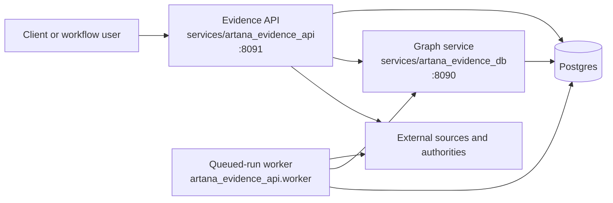
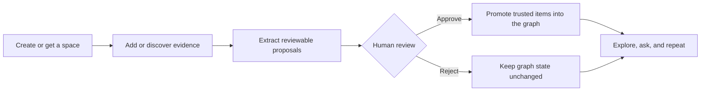

# Artana Evidence Platform

Artana is infrastructure that turns scientific reading into **governed
knowledge**: every claim traceable to an exact source, preserved with the
context that makes it meaningful, aggregated only under explicit and versioned
rules, and accountable to named human judgment.

The central conviction, and the thing that shapes every boundary in this repo:

> **LLMs propose. The system governs.**

Language models are the fastest and broadest *reading* layer available, and
wrong often enough that their output can never be authoritative on its own.
They are also not the only thing that proposes. Specialized biomedical readers,
curated knowledge bases, ontology authorities, structured databases, and
analytical pipelines all produce candidate assertions, identity mappings, and
evidence records. Artana is designed to govern outputs from systems like these
on the same terms it governs a language model's.

Nothing becomes trusted merely because it was produced by a capable model,
extracted by a domain reader, imported from a curated database, or stamped with
an ontology identifier. Those outputs stay attributable *inputs* until their
provenance is preserved, their identity and evidence bindings are verified, the
research space's policy is applied, and the resulting decision is recorded.

The full framing is in
[Vision and Direction (v2.0)](docs/artana-vision-and-direction.md), which is
authoritative for *why* the system is shaped this way.

This repository is the backend home for that work: an Evidence API plus a
governed graph/evidence service. It runs as an independent project with its own
local setup, service contracts, migrations, tests, and operational checks, and
it is intentionally backend-only. Product apps, notebooks, SDKs, and other
clients integrate through the generated OpenAPI contracts instead of living
here.

"Backend-only" is about *clients*, not about integrations. Source and authority
adapters belong in this repository and are owned by the Evidence API — the
typed registry in
[`source_adapters.py`](services/artana_evidence_api/source_adapters.py), the
plugins under
[`source_plugins/`](services/artana_evidence_api/source_plugins/registry.py),
and service-local runtimes such as
[`mondo_runtime.py`](services/artana_evidence_api/mondo_runtime.py). New
source-integration work goes here. What lives elsewhere is anything that
*consumes* the API.

### How to read this README

Three different kinds of statement live below, and they are kept apart on
purpose:

| Section | What it tells you | How to read it |
| --- | --- | --- |
| **The Architecture We Are Building** | The durable design contract and its invariants. | Stable. Changes to this are product decisions, not implementation drift. |
| **Current Status** | What the code demonstrably does today, with code references. | Dated and verifiable. Expect it to move. |
| **Known Gaps And Intended Integrations** | What is missing, and what is designed for but not built. | Read each entry for what *is* built: some describe a partly-working capability and name the missing part. |

Implementation gaps in the second and third sections do not narrow the first.
The architecture is the thing being built toward; the status is how far along it
is.

## The Architecture We Are Building

### The claim-first model

The single most important design decision, and the one every other boundary
follows from:

> **Claims and their evidence are the governed record. Canonical graph
> relations are projections derived from that record.**

```text
Source artifact
  -> verified snapshot and locator
  -> claim evidence
  -> claim ledger
  -> governed resolution
  -> canonical relation projection
  -> read models, paths, and exports
```

A canonical relation is rebuilt when supporting claims change, a claim is
rejected or retracted, a source becomes ineligible, dictionary rules change, or
a projection policy is updated. When no valid supporting claim remains, the
derived relation is removed **without** deleting the source evidence, the claim
history, or the review record.

Reasoning paths, neighbor indexes, relation summaries, embeddings, and
confidence aggregates are derived in the same sense. They make retrieval
better; they never become the record.

This is what lets the system change its mind without losing history — and it is
why a merge policy can be revised and re-derived rather than migrated away.

### The invariants

These are commitments, not descriptions of current coverage. Each one has known
violations in the code today, and Known Gaps names them.
`tests/unit/test_governance_invariants.py` pins four of those claims to the code
they depend on; the rest — evidence validation, claim-to-claim edges,
observation provenance — are unpinned, so closing one of those gaps will not
fail any test and this section has to be updated by hand:

1. **Sources and evidence remain preserved.** Interpretations are revisable;
   what a source said is not. Custody of the exact snapshot, locator, and span
   outlives every model, prompt, and schema that read it.
2. **Claims are governed interpretation records.** A claim carries its
   participants, roles, qualifiers, polarity, and evidence bindings — not a
   flattened triple. Discarding qualifiers to simplify storage manufactures
   false claims, so the claim layer is where that is refused.
3. **Canonical relations are rebuildable projections.** Nothing downstream of
   the ledger is authoritative. Anything derived can be dropped and
   regenerated under a better policy.
4. **External systems do not become authorities by being structured or
   curated.** A curated database, an ontology identifier, a specialized reader,
   and a language model are all *proposers*. Governance is applied to their
   output on identical terms.

### Core concepts

Enough to read the API without guessing. The authoritative lists live in code
and in the generated contracts — this section deliberately does not restate
them, because a third copy is a third thing to keep in sync.

**Entities** are graph nodes scoped to a research space, each with a stable
UUID, an approved dictionary entity type, normalized aliases, and zero or more
authority identifiers. Entity creation is create-or-resolve: the server
normalizes the type, loads the active resolution policy, checks identifier
anchors first, falls back to normalized labels and aliases only when policy
allows, and raises a conflict rather than guessing between multiple exact
candidates. Embeddings may *propose* candidates; they never decide identity or
perform unreviewed merges.

**Claims** are the primary governed interpretation records — relation type,
claim text, polarity, validation state, persistability, claim status, source
reference, and optional link to a canonical relation. Claim *participants*
carry role semantics beyond a binary triple: `SUBJECT`, `OBJECT`, `CONTEXT`,
`QUALIFIER`, `MODIFIER`, `OUTCOME`. Claims can also relate to other claims, so
contradiction, refinement, and dependency are first-class rather than inferred.

**Claim evidence** is stored separately from the claim: exact span, verified
snapshot, locator, provenance status and reason codes, evidence tier, and model
or agent-run provenance. Evidence required for promotion must be bound to a
source; free text without custody may stay reviewable but is not persistable
support. Source binding is enforced at the promotion boundary, not on every
write — the evidence record itself permits an unbound row, and Known Gaps says
what that costs.

**Canonical relations** are edges derived from eligible claims. Only support
claims that are resolved, persistable, properly grounded, permitted by an exact
relation constraint, and backed by eligible source evidence can materialize one.
The admin direct-write route is not an exception to this: it validates the
triple, requires a verified source snapshot, and materializes through the same
claim projection service. It skips the review queue, not the eligibility rules.
Relations stored before lineage was enforced are the real exception, and Known
Gaps records them.

**Scoping qualifiers change canonical identity.** "A activates B in humans" and
"A activates B in mice" are distinct governed propositions, as are two claims
that differ by tissue. Descriptive qualifiers — effect size, p-value, sample
size — do not split a relation. Which qualifiers scope is scientific policy,
and that policy is the durable commitment. How the current fingerprint computes
it, and the two defects in that computation, are in Current Status and Known
Gaps rather than here.

**Observations** exist so that not every measurement is forced into a relation:
subject, variable, typed value, unit, time, and provenance. Numbers, dates,
coded values, booleans, and structured JSON can be preserved before or
independently of any higher-level claim.

**The dictionary** governs the vocabulary the graph may use — domain contexts,
entity and relation types, synonyms, resolution policies, relation constraints,
qualifier definitions, value sets, review state, and revocation history. A
machine may propose a missing type or constraint; an undefined term never
silently becomes graph vocabulary.

## System Shape


```mermaid
flowchart LR
    Client["Client or workflow user"] --> API["Evidence API<br/>services/artana_evidence_api<br/>:8091"]
    API --> Sources["External sources and authorities"]
    API --> DB["Graph service<br/>services/artana_evidence_db<br/>:8090"]
    API --> PG[("Postgres")]
    Worker["Queued-run worker<br/>artana_evidence_api.worker"] --> PG
    Worker --> DB
    Worker --> Sources
    DB --> PG
```

The Evidence API is the public workflow surface. It handles authentication,
spaces, ingestion, source search, review queues, proposals, run state, and AI
orchestration.
The queued-run worker picks long-running tasks off the shared Postgres queue and
executes them out of band, against the same stores and the same graph boundary.
The graph service is the governed evidence system. It owns graph entities,
claims, participants, evidence lineage, dictionary rules, validation, canonical
projections, and graph-facing contracts.

Local development runs both services against one Postgres server. Deployed
environments can give the graph service its own connection and schema through
`GRAPH_DATABASE_URL` and `GRAPH_DB_SCHEMA`; each service owns its own migrations
either way.

## Main Workflow


```mermaid
flowchart LR
    A["Create or get a space"] --> B["Add or discover evidence"]
    B --> C["Extract reviewable proposals"]
    C --> D{"Human review"}
    D -->|Approve| E["Promote trusted items into the graph"]
    D -->|Reject| F["Keep graph state unchanged"]
    E --> G["Explore, ask, and repeat"]
    F --> G
```

The review queue is the trust gate. More precisely, the gate is the whole
governance boundary: review decisions, validation, evidence eligibility, and
policy all sit between a proposal and the graph. AI workflows can search,
screen, extract, ground, propose, compare, and prepare review packets. None of
that becomes trusted graph knowledge by completing successfully.

One documented exception, because "the trust gate" reads as universal and is
not: a graph-service admin can `POST /v1/spaces/{space_id}/relations` to create
a support claim and materialize a canonical relation in the same request, with
no proposal and no queue decision
([mutations.py](services/artana_evidence_db/routers/relation_routes/mutations.py#L190)).
Non-admins get a 403 telling them to go through claims. It is a separate
promotion path for operators, not a hole, but it is not the queue.

Each of the following is enforced in code today, on the server rather than by
convention:

- **A machine's judgment never wears a human's name.** Automated qualification
  and human acceptance are separate actions, and each recorded decision carries
  the identity that made it.
- **Merges are not decided by wording.** Identity comes from authorities and
  governed resolution policies; models and embeddings may propose candidates,
  never adjudicate them.
- **A quote is not proof.** Source custody, quote presence, entailment, and the
  promotion decision are separate questions, verified separately.
- **AI authority is authenticated, not asserted.** The authenticated graph
  principal must match the declared one, be trusted by space policy, carry a
  current input hash, stay inside the allowed risk tier and operating mode, and
  clear DB-computed policy thresholds.
- **Policy-rejected machine actions are retained.** An AI decision denied on
  policy grounds is committed for audit before the error returns. This does not
  extend to every denial: quarantine and validation failures roll the
  transaction back, so those attempts leave no durable record. See Known Gaps.
- **Confidence is computed, not self-reported.** Callers submit a qualitative
  `FactAssessment`; the graph service derives a deterministic governance weight.
  That number is not presented as a scientific probability.
- **A relation must have an allowed shape.** The exact source-type,
  relation-type, and target-type combination must be permitted by an active
  constraint.

Each graph space selects an operating mode — `manual`,
`ai_assist_human_batch`, `human_evidence_ai_graph`, `ai_full_graph`,
`ai_full_evidence`, or `continuous_learning`. Modes decide what machines may
prepare, recommend, repair, or apply. They do **not** override hard validation,
evidence, identity, provenance, or quarantine requirements.

Read the AI modes as configured policy rather than an available path. The mode
evaluator will return `ai_allowed_when_low_risk`, and the quarantine then
rejects the write anyway, because it fires on authorship regardless of mode. No
AI-authored claim, claim-relation, or canonical-relation write can complete
today. The modes describe what will be permitted once the quarantine lifts.

## Current Status

Status date: **July 30, 2026.** This section describes demonstrated behavior,
with references. It is not a roadmap, and it does not bound the architecture
above.

| Capability | Plain statement | State |
| --- | --- | --- |
| **READ** | Given one document's text, find the claims in it. | Runs; measurable. |
| **GROUND** | Bind each claim to an exact span, with a receipt someone else can check. | Runs; emitted offsets are absolute and comparable to gold. |
| **CONNECT** | Recognize an entity across papers; end with one node supported by five papers, not five nodes. | **Not measurable end to end on the AI-authored path.** |

### What works today

- **The human and curator path runs end to end.** Manually authored and
  curator-resolved claims create participants, attach verified evidence, resolve
  into canonical relations, and read back through the graph APIs.
- **Entity resolution is identifier-first.** The create-or-resolve path
  normalizes the type, applies the active resolution policy, prefers authority
  identifier anchors over labels, and raises a conflict instead of guessing
  between multiple exact candidates.
- **Ontology-backed ingestion works at the identifier level.** Ontology entities
  and identifiers can be imported and referenced. The authority layer around
  them is incomplete — see Known Gaps.
- **AI-authored promotion is quarantined, deliberately.** Promotion of an
  agent-authored qualified claim returns HTTP 409
  `qualified_claim_persistence_not_ready`
  ([proposal_actions.py:843](services/artana_evidence_api/proposal_actions.py#L843),
  enforced graph-side by
  [ai_persistence_quarantine.py](services/artana_evidence_db/validation/ai_persistence_quarantine.py)).
  The graph contract cannot yet persist a complete `ClaimFrame` without loss, so
  it refuses the write rather than silently dropping participants or qualifiers.
  This is the fail-closed behavior working, not an outage.

The measurement plan behind this table is
[Validating READ, GROUND, CONNECT](docs/validation/2026-07-25-product-validation-read-ground-connect.md).

### What has landed recently

- **Server-owned support semantics** — claim support is no longer derived from
  caller-supplied metadata.
- **No silent loss** — colliding proposals are retained for review instead of
  dropped during de-duplication.
- **Attributed human judgment** — automated qualification and human acceptance
  are separate paths, and the deciding identity is persisted rather than
  replaced by a generic system actor
  ([ReviewActor](services/artana_evidence_api/types/review_actor.py)).
- **Honest evidence strength** — corroboration counts distinct documents and
  source families rather than repeatedly counting rows from one source.
- **Trust ladder** — extracted candidates are tiered by hard floors the service
  computes; callers cannot self-declare a higher tier
  ([trust_ladder.py](services/artana_evidence_api/document_extraction_support/trust_ladder.py)).
- **Reproducible extraction attempts** — every model attempt on the
  document-extraction path records a request digest
  ([attempt_audit.py](services/artana_evidence_api/document_extraction_support/llm_extraction/attempt_audit.py)),
  and two environment bypasses of configured model selection are closed. The
  digest does not yet extend to the evidence-selection attempt ledger, and
  `[models.formal]` is declared but unread — see Known Gaps.
- **Measured noise floor** — replaying a sealed prompt byte-identically 20×
  per case reproduces the complete panel verdict **42.5%** of the time
  ([report](docs/validation/reports/2026-07-25-staged-generalization-v17-noise-floor.md)).
  The standing rule: *a single run is a record of what happened, never evidence
  about a configuration.*

## Known Gaps And Intended Integrations

This section is the distance between the code and the architecture above: what
is missing, and which part of a partly-built thing is missing. Where something
does work today the entry says so explicitly rather than being omitted — the
ontology entry below is the case that matters, because MONDO ingestion runs and
only the governance layer around it does not.

### Where the invariants do not hold yet

These are the known violations of the four commitments in the Architecture
section. They are listed first because the invariants are the product, and a
reader who takes them literally today will be wrong in these specific ways.

- **Canonical relations can exist with no claim-backed lineage.** Invariant 3
  says relations are projections of the ledger. The projection-readiness service
  has a dedicated audit that counts relations with no lineage and a repair
  operation to fix them
  ([claim_projection_readiness_service.py](services/artana_evidence_db/claim_projection_readiness_service.py#L251)),
  and relation queries expose an option to include non-claim-backed rows.
  Lineage is enforced for newly materialized projections; it is not a global
  property of everything stored. Repair is an admin action, not automatic
  reconciliation.
- **Claim evidence permits an unbound row.** Invariant 1 says custody of the
  snapshot, locator, and span outlives everything. In the evidence model those
  fields are all optional and `provenance_status` defaults to
  `LEGACY_UNVERIFIED` with reason code `legacy_evidence_without_typed_provenance`
  ([claim_evidence_models.py](services/artana_evidence_db/claim_evidence_models.py#L26)).
  Source binding is a promotion-boundary requirement, not a write-time one.
- **Exact evidence validation is opt-in by payload shape.** The source-evidence
  validator returns success immediately when a write carries no typed
  source-evidence handoff
  ([source_evidence_write_validation.py](services/artana_evidence_db/validation/source_evidence_write_validation.py#L41)).
  "A quote is not proof" is enforced on the manual canonical-relation path, not
  uniformly at claim creation.
- **Claim-to-claim edges are not source-grounded or curator-approved by
  construction.** Contradiction and refinement are first-class record types, but
  the create request takes `review_status` as a free-form string defaulting to
  `PROPOSED`, with source document fields optional
  ([claim_graph_schemas.py](services/artana_evidence_db/graph_api_schemas/claim_graph_schemas.py#L107)).
  A caller can submit an edge already marked accepted. This is the same shape as
  the caller-supplied-support defect already closed for claim support.
- **Observation provenance is required for everything except manual entry.**
  `validate_observation_write` rejects any observation whose origin is not
  `MANUAL` and which carries neither a provenance record nor a provenance id,
  with blocking code `missing_provenance`. That covers imported and AI-authored
  observations alike. The gap is the `MANUAL` hole, not a narrow AI-only rule:
  a human-entered observation can be stored with no provenance at all.

### Identity and persistence gaps

- **Lossless `ClaimFrame` persistence does not exist.** This is what the
  AI-authored quarantine is waiting on, and it is the largest single item.
  Until the graph contract can round-trip a complete qualified claim, refusing
  the write is the correct behavior.
- **Cross-document claim identity is detected but never adjudicated.**
  `ClaimFrame.dedupe_identity` hashes the whole normalized frame, so two papers
  carrying the same sentence and otherwise identical fields *do* collide, and
  `proposal_store` catches that: the second proposal is parked as
  `IDENTITY_PENDING` rather than dropped, because deciding whether it is
  genuinely the same assertion needs an identity model that does not exist yet.
  What is missing is the adjudication and merge, not the collision.
  Do not plan a CONNECT experiment on the premise that two papers can never
  produce the same key — they can, and the parked rows are where the evidence
  for that is. Note that
  [the July 25 measurement plan](docs/validation/2026-07-25-product-validation-read-ground-connect.md)
  states this gap as identity being "zero by construction"; that framing is
  stronger than the code supports and is being reconciled separately.
- **Authority identifier normalization is not uniform.** Ontology loaders,
  extraction and CURIE linking, source plugins, and manual entity APIs need one
  canonical namespace and value representation for MONDO, HGNC, HPO, UniProt,
  and ClinVar identifiers before cross-source identity can be called reliable.
- **Ontology hierarchy has no governed representation.** The builtin relation
  set has `INSTANCE_OF` and no `SUBCLASS_OF`, so class hierarchy depends on
  instance-level relations rather than an explicit, constrained edge with active
  exact constraints.
- **Graph entities and governed concept members are not unified by one identity
  contract.** Whether concepts are canonical identities that entities reference,
  or governed groupings of canonical entities, is not settled in one place.
- **Two builtin qualifier sets disagree.** Canonical identity is computed from
  [`qualifier_registry.py`](services/artana_evidence_db/qualifier_registry.py),
  which marks five qualifiers as scoping — including `tissue`. The dictionary
  seed in
  [`graph_domain_qualifiers.py`](services/artana_evidence_db/graph_domain_qualifiers.py)
  marks four and omits `tissue`, while carrying a `polarity` entry the registry
  does not define. Treat the registry as authoritative for what splits a
  relation until these are reconciled.
- **Scoping values collapse across participants.** The fingerprint builder
  merges each participant's qualifiers into one flat mapping, so when two
  participants carry the same scoping key the last one wins. A claim whose
  subject and object differ in `tissue` fingerprints identically to one where
  only the object's value is set, which can merge canonical relations that the
  scoping rule is supposed to keep apart. Scoping values need to be keyed by
  participant before the tissue guarantee above holds in the general case.

### Measurement and reproducibility limits

- **Formal runs do not use the formal model.** `[models.formal]` is declared in
  `artana.toml`, but no production code path reads it — the only callers of
  `ArtanaModelRegistry.formal_model()` are tests. Extraction and the claim
  verification loop resolve `default_evidence_extraction` instead, so changing
  a default *does* move formal traffic, and the `ARTANA_CLAIM_*_MODEL`
  variables can still redirect verification even with runtime overrides
  disabled. Until the formal profile is wired in, do not attribute a sealed
  result to the model named there.
- **The formal model is also not snapshot-pinned.** No dated snapshot is
  published for it, so an alias can move underneath a run even once it is wired
  in. Recorded in `artana.toml` rather than papered over.
- **Request digests cover one path.** Document-extraction model attempts record
  a request digest; the evidence-selection attempt ledger
  (`SemanticModelAttemptContext`, `SemanticRuntimeModelAttempt`) does not, so
  those attempts cannot be compared or replayed the same way.
- **Not every denied machine action leaves a record.** Policy rejections are
  committed before the error returns, but quarantine and validation failures
  roll back, so no durable attempt record survives those paths.
- **Extraction accuracy is an input, not the headline.** Progress is reported as
  traceability, identity correctness, qualifier preservation, review
  throughput, and disagreement surfaced.
- **Broad AI persistence stays closed** until the gates pass. Fail-closed is the
  default outside explicitly approved pilot paths.

### Intended integrations

Artana is designed to consume domain-specific scientific systems without handing
them governance authority. **INDRA and DisMech have no production adapter
today**; ontology authorities are partly built, and the entry below says which
part. They are recorded here because they define the intended boundary, and the
invariant that boundary has to satisfy:

> Imported or machine-produced output keeps its native provenance and stays
> distinct from Artana-reviewed knowledge until governed promotion occurs.

```text
externally curated  ≠  imported  ≠  reviewed in this space  ≠  promoted
```

- **INDRA** — intended as a domain processor, candidate generator, and
  downstream assembler: mechanistic statements in as attributable candidates,
  approved claims out for network or executable model assembly. Not built. There
  is no INDRA code in this repository; it appears only in the validation docs as
  a comparable *system* for eventual head-to-head evaluation, not as ground
  truth.
- **DisMech** — intended as a curated disease-mechanism source, a domain
  profile, a benchmark corpus, and an export target, preserving native
  identifiers, schema version, and source commit on import. Not built. What
  exists today is narrower and should not be mistaken for it: a document already
  uploaded to a space, tagged as DisMech or a YAML file titled as one, is parsed
  deterministically into review-gated proposal drafts by
  [`dismech_structured.py`](services/artana_evidence_api/document_extraction_support/dismech_structured.py).
  That is document-format support with no network calls — nothing connects to
  DisMech as a system, imports its corpus, or exports back to it.
- **Ontology authorities** — MONDO, HGNC, HPO, GO, UniProt contribute
  identifiers, labels, aliases, and hierarchy. They answer *what concept is
  this?* They do not answer *does this source support this claim?*, and an
  ontology identifier alone is never evidence. Unlike the two above, this one is
  partly built: MONDO has a working fetch, parse, and ingestion runtime
  ([mondo_runtime.py](services/artana_evidence_api/mondo_runtime.py)) that pulls
  a release over HTTP, and MONDO and HGNC are registered authority plugins. What
  is missing is the governance layer around that ingestion — uniform identifier
  normalization, release lineage, hierarchy materialization, and the
  concept-to-entity identity contract, all listed under Identity gaps above.

## Repository Layout

- `services/artana_evidence_api`: the Evidence API for research spaces, local
  identity, document ingestion, source discovery, durable direct source-search
  handoff, review queues, proposals, graph chat/search orchestration, guarded
  AI runs, claim framing/verification/falsification, and user-facing workflow
  state.
- `services/artana_evidence_db`: the graph/evidence service for entities,
  relations, observations, provenance, relation evidence, claims and claim
  participants, dictionary governance, validation, graph views, operating
  modes, and graph service API contracts.
- `docs/`: direction, architecture notes, user guides, validation protocols and
  reports, status, and operating guidance.
- `scripts/`: repository checks, contract helpers, validation harnesses, and
  local automation.
- `tests/`: repository-level regression and boundary tests that do not belong
  to one service tree. Service-specific tests live under each service.

Keep workflow orchestration, source interaction, document processing, and
machine-reading execution in `services/artana_evidence_api`.
Keep graph persistence, entity identity, dictionary governance, claim
semantics, validation, provenance eligibility, and canonical projections in
`services/artana_evidence_db`.

The Evidence API reaches the graph service through typed HTTP contracts. Normal
runtime behavior must not import graph implementation internals across that
boundary.

## Start Locally

Prerequisites:

- Python 3.13 or newer.
- Docker with Compose support for the local Postgres container.
- A shell that can run the repo `Makefile` targets.

```bash
make install-dev
```

```bash
make run-all
```

`make run-all` starts local Postgres, the graph service on
`http://127.0.0.1:8090`, the Evidence API on `http://127.0.0.1:8091`, and the
queued-run worker. It also applies the required schemas and service migrations
through `make setup-postgres`.

On first run, the Makefile creates `.env.postgres` from `.env.postgres.example`
if needed. Keep production secrets out of this local file; deployed
environments must provide their own JWT and database settings.

Container note: `docker-compose.postgres.yml` starts Postgres for local
development. Each service also has its own Dockerfile for runtime/test images.
Use `make run-all` for the local two-service development stack.

After `make run-all` is ready, verify the local Evidence API from another
terminal:

```bash
curl http://127.0.0.1:8091/health
```

Model and runtime defaults load from
[`services/artana_evidence_api/artana.toml`](services/artana_evidence_api/artana.toml),
and `allow_runtime_model_overrides` is `false` by default.

What actually selects the model today: extraction resolves
`default_evidence_extraction` through the registry's capability lookup and
passes it down as the default for claim framing, verification, repair, and
reverification. `[models.formal]` declares the model that formal runs are
*meant* to name, but no runtime path reads it — see Known Gaps before
attributing a sealed result to it.

## Client Integration

Current backend contracts live in the generated OpenAPI and TypeScript contract
files listed below. New clients should treat those files, plus the user guide
and endpoint index, as the integration surface.

- [User Guide](docs/user-guide/README.md)
- [Endpoint Index](docs/user-guide/09-endpoint-index.md)
- `services/artana_evidence_api/openapi.json`
- `services/artana_evidence_db/openapi.json`
- `services/artana_evidence_db/artana-evidence-db.generated.ts`

The Evidence API currently publishes OpenAPI only. TypeScript clients should
generate from `services/artana_evidence_api/openapi.json`; the checked-in
TypeScript artifact is specific to the graph service. If dedicated product,
SDK, or notebook repositories are created,
link them here as client projects rather than adding them to this repository.
Source and authority adapters are not clients and do not belong on that list:
they are Evidence API code, as the opening section says.

The public Evidence API surface is `/v2`; `/v1` remains only as a compatibility
layer while the cutover finishes. See
[V2 API Migration Plan](docs/v2_api_migration_plan.md).

### Evidence sources

Direct source search is durable in the Evidence API. Clients can search enabled
sources, fetch the captured search result later by id, and hand off a selected
record through
`POST /v2/spaces/{space_id}/sources/{source_key}/searches/{search_id}/handoffs`.
That handoff creates review-gated extraction input or a durable source document;
it does not automatically promote graph facts.

Sources are plugin-owned and registered explicitly
([registry.py](services/artana_evidence_api/source_plugins/registry.py)). Ask
the running service for the current set rather than trusting a list in prose.
`/v2/sources` requires read access like the rest of `/v2`, so create a local
user and key first with `POST /v2/auth/bootstrap` (see
[Getting Started](docs/user-guide/01-getting-started.md)), then pass it in the
`X-Artana-Key` header:

```bash
curl -H "X-Artana-Key: $ARTANA_API_KEY" http://127.0.0.1:8091/v2/sources
```

Without that header the request returns 401, not the registry.

At the status date above, direct search is enabled for PubMed, MARRVEL,
Monarch, ClinVar, DrugBank, DrugMechDB, AlphaFold, gnomAD, UniProt,
ClinicalTrials.gov, MGI, ZFIN, Orphanet, DiMe, and DHDR. HGNC and MONDO are
registered as identifier authorities, and PDF/text as document-ingestion
sources; none of those four are direct-search sources. Adding one is documented
in the [Source Plugin Guide](docs/source_plugins.md).

## Docs

- [Vision and Direction (v2.0)](docs/artana-vision-and-direction.md) — start here
- [Current System](docs/architecture/current-system.md)
- [Validating READ, GROUND, CONNECT](docs/validation/2026-07-25-product-validation-read-ground-connect.md)
- [User Guide](docs/user-guide/README.md)
- [Endpoint Index](docs/user-guide/09-endpoint-index.md)
- [Docs Index](docs/README.md)
- [Remaining Work](docs/remaining_work_priorities.md)
- [Evidence Excellence Progress Tracker](docs/validation/evidence-excellence-progress-tracker.md)
- [Module Packaging Plan](docs/architecture/module-packaging-plan.md)
- [Source Plugin Guide](docs/source_plugins.md)
- [Restricted Corpora Policy](scripts/validation/RESTRICTED_CORPORA.md)

Some docs under `docs/` carry an April 30, 2026 status date and describe the
repo shape at that point. When documents disagree: the vision document is
authoritative for direction, the generated contracts for public API shape, and
the code for runtime behavior.

## Service Gates

`make all` is an alias for `make service-checks`, the normal CI gate:

```bash
make all
```

It runs, in order:

| Gate | What it enforces |
| --- | --- |
| Graph static core | ruff, mypy, service-boundary check, contract check, `graph-phase6-release-check` |
| Evidence API static core | ruff, mypy, service-boundary check, contract check, agent-output boundary registry, two frozen evidence-selection semantic baselines |
| `architecture-size-check` | per-file line budget; overrides live in `architecture_overrides.json` and are a ratchet, not headroom |
| `architecture-structure-check` | package structure and root-module sprawl budgets under `architecture_structure_overrides.json` |
| `restricted-corpus-digest-check` | licence-restricted corpus text has not come back (offline half) |
| `typing-any-check` | the `Any` ban in guarded trees |
| `relation-feasibility-quality-gate` | relation-feasibility regression suite |
| `coverage-check` | isolated Postgres tests across both service trees, `--cov-fail-under=86` |

The two per-service aggregates additionally run that service's full test suite:

```bash
make graph-service-checks
```

```bash
make artana-evidence-api-service-checks
```

The graph service lives in `services/artana_evidence_db`; its Makefile targets
use the `graph-service-*` prefix. The Evidence API lives in
`services/artana_evidence_api`; its Makefile targets use the
`artana-evidence-api-*` prefix. `make help` lists every target.

Useful focused checks:

```bash
make graph-service-contract-check
```

```bash
make artana-evidence-api-contract-check
```

```bash
make graph-service-boundary-check
```

```bash
make artana-evidence-api-boundary-check
```

Live/external tests are not required for normal CI; they skip with explicit
messages unless their environment variables or local services are available.

## Guardrails Worth Knowing Before You Commit

These exist because each one has already been violated at least once, and each
comment in the config records how.

**Install the pre-commit hooks.** Lint, type checks, architecture size and
structure, the restricted-corpus digest check, the `Any` ban, and both contract
checks now run locally, not only in CI.

```bash
pre-commit install
```

**Run the README pin tests yourself when you edit this file.** A README-only
change is planned as `docs_only`, which switches off the repo-control job — so
the tests that pin exact strings in this file do not run in CI for the change
that breaks them. They surface later on somebody else's unrelated PR.

From your activated project environment — `venv/` and `.venv/` are both
supported layouts, so use whichever `make install-dev` created:

```bash
python3 -m pytest tests/unit/test_control_files.py tests/unit/test_governance_invariants.py -q
```

**Never commit licence-restricted corpus text.** This repository is public and
the BioNLP-ST 2011 GE licence does not permit us to republish it. Offsets,
digests, mappings, counts, and bare entity names are committed; document text,
spans, and any verbatim run of 40+ normalized characters are not — including in
comments, docstrings, prompt strings, fixtures, and test inputs. The full rule,
and the one disclosed exception, are in
[RESTRICTED_CORPORA.md](scripts/validation/RESTRICTED_CORPORA.md). The offline
half of the guard runs on every pull request regardless of what it touched; the
thorough half needs the corpus fetched on demand with
`scripts/fetch_bionlp_ge_corpus.py`, then:

```bash
make restricted-corpus-scan
```

**No `Any` in guarded trees.** Use concrete types, protocols, dataclasses,
Pydantic models, or service-local typed contracts. ruff cannot express the rule
for local annotations, so a dedicated parser enforces it.

**Keep generated contracts current.** Changing a service schema means
regenerating OpenAPI and, for the graph service, the TypeScript client too.

**Agent output schemas declare their boundaries.** Registering a new agent
output schema requires regenerating the boundary registry report, so categorical
fields cannot enter without being declared.

See [AGENTS.md](AGENTS.md) for the full working rules, service boundaries, and
security invariants.

## Live Checks

Run these only when you intentionally want to hit running local services or
public external APIs.

For the live local endpoint contract, start the stack in one terminal:

```bash
make run-all
```

Then run:

```bash
make live-endpoint-contract-check
```

For live PubMed, ClinVar, AlphaFold, MONDO, and related integration checks:

```bash
make live-external-api-check
```

For strict model-backed relation extraction, configure `OPENAI_API_KEY` or
`ARTANA_OPENAI_API_KEY`, then run:

```bash
make live-agent-relation-feasibility-check
```

To run both live groups, keep `make run-all` running and execute:

```bash
make live-service-checks
```

## Generated Contracts

- `services/artana_evidence_api/openapi.json`
- `services/artana_evidence_db/openapi.json`
- `services/artana_evidence_db/artana-evidence-db.generated.ts`

Regenerate graph artifacts with:

```bash
make graph-service-sync-contracts
```

Regenerate Evidence API OpenAPI with:

```bash
make artana-evidence-api-openapi
```
