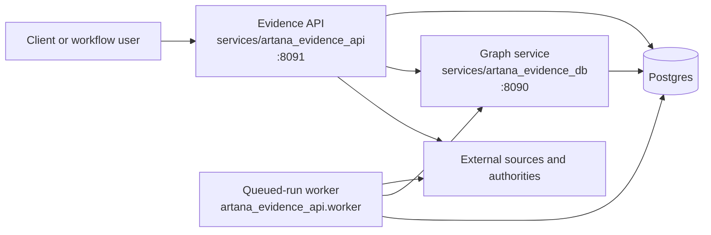
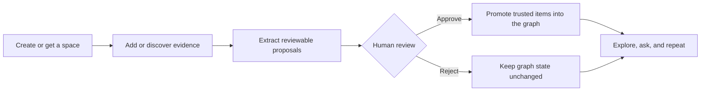

# Artana Evidence Platform

Artana is infrastructure that turns scientific reading into **governed
knowledge**: every claim traceable to an exact source, preserved with the
context that makes it meaningful, aggregated only under explicit and versioned
rules, and accountable to named human judgment.

The central conviction, and the thing that shapes every boundary in this repo:

> **LLMs propose. The system governs.**

Language models are the fastest and broadest *reading* layer available, and
wrong often enough that their output can never be authoritative on its own.
They are also not the only thing that proposes. Specialized biomedical readers,
curated knowledge bases, ontology authorities, structured databases, and
analytical pipelines all produce candidate assertions, identity mappings, and
evidence records. Artana governs all of them on the same terms.

Nothing becomes trusted merely because it was produced by a capable model,
extracted by a domain reader, imported from a curated database, or stamped with
an ontology identifier. Those outputs stay attributable *inputs* until their
provenance is preserved, their identity and evidence bindings are verified, the
research space's policy is applied, and the resulting decision is recorded.

Everything in this repository is the *knowing* layer around those inputs:
source custody, preserved qualifiers, authority-anchored identity, server-owned
verification, explicit merge and projection rules, and attributed human review.
A better extractor, reader, or knowledge base makes that substrate more
productive; it cannot substitute for it.

The full framing is in
[Vision and Direction (v2.0)](docs/artana-vision-and-direction.md), which is
authoritative for *why* the system is shaped this way.

This repository is the backend home for that work: an Evidence API plus a
governed graph/evidence service. It runs as an independent project with its own
local setup, service contracts, migrations, tests, and operational checks, and
it is intentionally backend-only. Product apps, notebooks, SDKs, domain
adapters, and other clients integrate through the generated OpenAPI contracts
instead of living here.

## Knowledge Authority Model

The single most important thing to understand before reading any other section:

> **Claims and their evidence are the governed record. Canonical graph
> relations are projections derived from that record.**

```text
Source artifact
  -> verified snapshot and locator
  -> claim evidence
  -> claim ledger
  -> governed resolution
  -> canonical relation projection
  -> read models, paths, and exports
```

A canonical relation can be rebuilt when supporting claims change, a claim is
rejected or retracted, a source becomes ineligible, dictionary rules change, or
a projection policy is updated. If no valid supporting claim remains, the
derived relation can be removed **without** deleting the source evidence, the
claim history, or the review record.

Reasoning paths, neighbor indexes, relation summaries, embeddings, and
confidence aggregates are derived data too. Claim and projection changes mark
affected paths `STALE` so they can be rebuilt from the ledger. They make
retrieval better; they never become the record.

This is what makes the system able to change its mind without losing history.

## Status

Status date: **July 30, 2026.** This section is the honest read, not a roadmap.

The substrate is largely built. Governance defects called out in the July
direction review have been closed one at a time, the reviewer surface exists,
and the human-authored claim-to-graph path works end to end. The AI-authored
path is **deliberately fail-closed** and not yet measurable.

| Capability | Plain statement | State |
| --- | --- | --- |
| **READ** | Given one document's text, find the claims in it. | Runs; measurable. |
| **GROUND** | Bind each claim to an exact span, with a receipt someone else can check. | Runs; emitted offsets are absolute and comparable to gold. |
| **CONNECT** | Recognize an entity across papers; end with one node supported by five papers, not five nodes. | **Not measurable end to end on the AI-authored path.** |

### Why CONNECT is blocked

Verified properties of the current tree, not estimates:

- **AI-authored claim persistence is quarantined.** Promotion of an
  agent-authored qualified claim returns HTTP 409
  `qualified_claim_persistence_not_ready`
  ([proposal_actions.py:843](services/artana_evidence_api/proposal_actions.py:843),
  enforced graph-side by
  [ai_persistence_quarantine.py](services/artana_evidence_db/validation/ai_persistence_quarantine.py)).
  The graph contract cannot yet persist a complete `ClaimFrame` without loss, so
  it refuses the write rather than silently dropping participants or qualifiers.
- **Cross-document claim identity is zero by construction** while the claim
  de-duplication key includes the source span — a span from paper A can never
  equal a span from paper B, even when both support the same proposition.
- The **human and curator path is not inert**: those claims create participants,
  attach verified evidence, resolve into canonical relations, and read back
  through the graph APIs. The wall is specific to agent-authored claims.

Three further identity risks must be resolved before cross-source identity can
be called reliable on *any* ingestion path:

- **Authority identifier normalization is not uniform.** Ontology loaders,
  extraction and CURIE linking, source plugins, and manual entity APIs need one
  canonical namespace and value representation for MONDO, HGNC, HPO, UniProt,
  and ClinVar identifiers.
- **Ontology hierarchy has no governed representation.** The builtin relation
  set has `INSTANCE_OF` and no `SUBCLASS_OF`, so class hierarchy currently
  depends on instance-level relations rather than an explicit, constrained edge.
- **Graph entities and governed concept members are not unified by one identity
  contract.** Whether concepts are canonical identities that entities reference,
  or governed groupings of canonical entities, is not yet settled in one place.

The measurement plan is
[Validating READ, GROUND, CONNECT](docs/validation/2026-07-25-product-validation-read-ground-connect.md).

### What has landed recently

- **Server-owned support semantics** — claim support is no longer derived from
  caller-supplied metadata.
- **No silent loss** — colliding proposals are retained for review instead of
  dropped during de-duplication.
- **Attributed human judgment** — automated qualification and human acceptance
  are separate paths, and the deciding identity is persisted rather than
  replaced by a generic system actor
  ([ReviewActor](services/artana_evidence_api/types/review_actor.py)).
- **Honest evidence strength** — corroboration counts distinct documents and
  source families rather than repeatedly counting rows from one source.
- **Trust ladder** — extracted candidates are tiered by hard floors the service
  computes; callers cannot self-declare a higher tier
  ([trust_ladder.py](services/artana_evidence_api/document_extraction_support/trust_ladder.py)).
- **Reproducible model attempts** — every attempt records a request digest, the
  formal-run model is named explicitly in `artana.toml`, and the two
  environment bypasses of configured model selection are closed.
- **Measured noise floor** — replaying a sealed prompt byte-identically 20×
  per case reproduces the complete panel verdict **42.5%** of the time
  ([report](docs/validation/reports/2026-07-25-staged-generalization-v17-noise-floor.md)).
  The standing rule: *a single run is a record of what happened, never evidence
  about a configuration.*

### Known limits, stated rather than implied

- **The formal model is named but not snapshot-pinned.** No dated snapshot is
  published for it, so an alias can move underneath a run. Recorded in
  `artana.toml` under `[models.formal]` rather than papered over.
- **Two builtin qualifier sets disagree.** Canonical identity is computed from
  [`qualifier_registry.py`](services/artana_evidence_db/qualifier_registry.py),
  which marks five qualifiers as scoping — including `tissue`. The dictionary
  seed in
  [`graph_domain_qualifiers.py`](services/artana_evidence_db/graph_domain_qualifiers.py)
  marks four and omits `tissue`, while carrying a `polarity` entry the registry
  does not define. Treat the registry as authoritative for what splits a
  relation, and expect this to be reconciled.
- **Extraction accuracy is an input, not the headline.** Progress is reported as
  traceability, identity correctness, qualifier preservation, review
  throughput, and disagreement surfaced.
- **Broad AI persistence stays closed** until the gates pass. Fail-closed is the
  default outside explicitly approved pilot paths.
- **Ontology ingestion is not a complete authority layer.** Ontology-backed
  entities and identifiers can be imported, but authority normalization, release
  lineage, hierarchy materialization, and concept-to-entity identity still need
  consolidation.

## Repository Layout

- `services/artana_evidence_api`: the Evidence API for research spaces, local
  identity, document ingestion, source discovery, durable direct source-search
  handoff, review queues, proposals, graph chat/search orchestration, guarded
  AI runs, claim framing/verification/falsification, and user-facing workflow
  state.
- `services/artana_evidence_db`: the graph/evidence service for entities,
  relations, observations, provenance, relation evidence, claims and claim
  participants, dictionary governance, validation, graph views, operating
  modes, and graph service API contracts.
- `docs/`: direction, architecture notes, user guides, validation protocols and
  reports, status, and operating guidance.
- `scripts/`: repository checks, contract helpers, validation harnesses, and
  local automation.
- `tests/`: repository-level regression and boundary tests that do not belong
  to one service tree. Service-specific tests live under each service.

Keep workflow orchestration, source interaction, document processing, and
machine-reading execution in `services/artana_evidence_api`.
Keep graph persistence, entity identity, dictionary governance, claim
semantics, validation, provenance eligibility, and canonical projections in
`services/artana_evidence_db`.

The Evidence API reaches the graph service through typed HTTP contracts. Normal
runtime behavior must not import graph implementation internals across that
boundary.

## System Shape


```mermaid
flowchart LR
    Client["Client or workflow user"] --> API["Evidence API<br/>services/artana_evidence_api<br/>:8091"]
    API --> Sources["External sources and authorities"]
    API --> DB["Graph service<br/>services/artana_evidence_db<br/>:8090"]
    API --> PG[("Postgres")]
    Worker["Queued-run worker<br/>artana_evidence_api.worker"] --> PG
    Worker --> DB
    Worker --> Sources
    DB --> PG
```

The Evidence API is the public workflow surface. It handles authentication,
spaces, ingestion, source search, review queues, proposals, run state, and AI
orchestration.
The queued-run worker picks long-running tasks off the shared Postgres queue and
executes them out of band, against the same stores and the same graph boundary.
The graph service is the governed evidence system. It owns graph entities,
claims, participants, evidence lineage, dictionary rules, validation, canonical
projections, and graph-facing contracts.

Local development runs both services against one Postgres server. Deployed
environments can give the graph service its own connection and schema through
`GRAPH_DATABASE_URL` and `GRAPH_DB_SCHEMA`; each service owns its own migrations
either way.

## Core Concepts

Enough to read the API without guessing. The authoritative lists live in code
and in the generated contracts, not here — this section deliberately does not
restate them.

**Entities** are graph nodes scoped to a research space, each with a stable
UUID, an approved dictionary entity type, normalized aliases, and zero or more
authority identifiers. Entity creation is create-or-resolve: the server
normalizes the type, loads the active resolution policy, checks identifier
anchors first, falls back to normalized labels and aliases only when policy
allows, and raises a conflict rather than guessing between multiple exact
candidates. Embeddings may *propose* candidates; they never decide identity or
perform unreviewed merges.

**Claims** are the primary governed interpretation records — relation type,
claim text, polarity, validation state, persistability, review status, source
reference, and optional link to a canonical relation. Claim *participants*
carry role semantics beyond a binary triple: `SUBJECT`, `OBJECT`, `CONTEXT`,
`QUALIFIER`, `MODIFIER`, `OUTCOME`. Claims can also relate to other claims, so
contradiction, refinement, and dependency are first-class rather than inferred.

**Claim evidence** is stored separately from the claim: exact span, verified
snapshot, locator, provenance status and reason codes, evidence tier, and model
or agent-run provenance. Evidence required for promotion must be bound to a
source; free text without custody may stay reviewable but is not persistable
support.

**Canonical relations** are edges derived from eligible claims. Only support
claims that are resolved, persistable, properly grounded, permitted by an exact
relation constraint, and backed by eligible source evidence can materialize one.

**Scoping qualifiers change canonical identity.** "A activates B in humans" and
"A activates B in mice" are distinct governed propositions. So are two claims
that differ by tissue. Descriptive qualifiers — effect size, p-value, sample
size — do not split a relation. The fingerprint also folds in `CONTEXT`
participant anchors and ordered participant sets, so identity is not qualifiers
alone. Which qualifiers scope is scientific policy: see
[`qualifier_registry.py`](services/artana_evidence_db/qualifier_registry.py),
and read the qualifier caveat under Known Limits before relying on it.

**Observations** exist so that not every measurement is forced into a relation:
subject, variable, typed value, unit, time, and provenance. Numbers, dates,
coded values, booleans, and structured JSON can be preserved before or
independently of any higher-level claim.

**The dictionary** governs the vocabulary the graph may use — domain contexts,
entity and relation types, synonyms, resolution policies, relation constraints,
qualifier definitions, value sets, review state, and revocation history. A
machine may propose a missing type or constraint; an undefined term never
silently becomes graph vocabulary.

## Main Workflow


```mermaid
flowchart LR
    A["Create or get a space"] --> B["Add or discover evidence"]
    B --> C["Extract reviewable proposals"]
    C --> D{"Human review"}
    D -->|Approve| E["Promote trusted items into the graph"]
    D -->|Reject| F["Keep graph state unchanged"]
    E --> G["Explore, ask, and repeat"]
    F --> G
```

The review queue is the trust gate. More precisely, the gate is the whole
governance boundary: review decisions, validation, evidence eligibility, and
policy all sit between a proposal and the graph. AI workflows can search,
screen, extract, ground, propose, compare, and prepare review packets. None of
that becomes trusted graph knowledge by completing successfully.

What the gate enforces on the server, rather than by convention:

- **A machine's judgment never wears a human's name.** Automated qualification
  and human acceptance are separate actions, and each recorded decision carries
  the identity that made it.
- **Merges are not decided by wording.** Identity comes from authorities and
  governed resolution policies; models and embeddings may propose candidates,
  never adjudicate them.
- **A quote is not proof.** Source custody, quote presence, entailment, and the
  promotion decision are separate questions, verified separately.
- **AI authority is authenticated, not asserted.** The authenticated graph
  principal must match the declared one, be trusted by space policy, carry a
  current input hash, stay inside the allowed risk tier and operating mode, and
  clear DB-computed policy thresholds.
- **Rejected machine actions are retained.** Denied attempts are persisted for
  audit before the error returns.
- **Confidence is computed, not self-reported.** Callers submit a qualitative
  `FactAssessment`; the graph service derives a deterministic governance weight.
  That number is not presented as a scientific probability.
- **A relation must have an allowed shape.** The exact source-type,
  relation-type, and target-type combination must be permitted by an active
  constraint.

### Operating modes

Each graph space selects an operating mode — `manual`,
`ai_assist_human_batch`, `human_evidence_ai_graph`, `ai_full_graph`,
`ai_full_evidence`, or `continuous_learning`. Modes decide what machines may
prepare, recommend, repair, or apply. They do **not** override hard validation,
evidence, identity, provenance, or quarantine requirements.

## Integrating Domain Systems

Artana is built to consume domain-specific scientific systems without handing
them governance authority. The invariant, whatever the source:

> Imported or machine-produced output keeps its native provenance and stays
> distinct from Artana-reviewed knowledge until governed promotion occurs.

```text
DisMech-curated  ≠  imported  ≠  reviewed in this space  ≠  promoted
```

What exists today:

- **DisMech** documents have a real ingestion path.
  [`dismech_structured.py`](services/artana_evidence_api/document_extraction_support/dismech_structured.py)
  performs deterministic — not model-driven — extraction over DisMech LinkML
  YAML, producing review-gated proposal drafts through
  [routers/documents.py:715](services/artana_evidence_api/routers/documents.py:715).
  Those drafts enter the same review queue as everything else.
- **INDRA** is not integrated. There is no adapter and no INDRA code in this
  repository. It is discussed in the validation docs as a comparable *system*
  for head-to-head evaluation, not as a source of ground truth.
- **Ontology authorities** — MONDO, HGNC, HPO, GO, UniProt — contribute
  identifiers, labels, aliases, and hierarchy. They answer *what concept is
  this?* They do not answer *does this source support this claim?*, and an
  ontology identifier alone is never evidence.

## Start Locally

Prerequisites:

- Python 3.13 or newer.
- Docker with Compose support for the local Postgres container.
- A shell that can run the repo `Makefile` targets.

```bash
make install-dev
```

```bash
make run-all
```

`make run-all` starts local Postgres, the graph service on
`http://127.0.0.1:8090`, the Evidence API on `http://127.0.0.1:8091`, and the
queued-run worker. It also applies the required schemas and service migrations
through `make setup-postgres`.

On first run, the Makefile creates `.env.postgres` from `.env.postgres.example`
if needed. Keep production secrets out of this local file; deployed
environments must provide their own JWT and database settings.

Container note: `docker-compose.postgres.yml` starts Postgres for local
development. Each service also has its own Dockerfile for runtime/test images.
Use `make run-all` for the local two-service development stack.

After `make run-all` is ready, verify the local Evidence API from another
terminal:

```bash
curl http://127.0.0.1:8091/health
```

Model and runtime defaults load from
[`services/artana_evidence_api/artana.toml`](services/artana_evidence_api/artana.toml).
Runtime model overrides are disabled by default, and formal runs — evaluation,
verification feeding a trust decision, and any extraction eligible for graph
promotion — name their model under `[models.formal]` so a change to the
defaults cannot silently move what a sealed result was produced with.

## Client Integration

Current backend contracts live in the generated OpenAPI and TypeScript contract
files listed below. New clients should treat those files, plus the user guide
and endpoint index, as the integration surface.

- [User Guide](docs/user-guide/README.md)
- [Endpoint Index](docs/user-guide/09-endpoint-index.md)
- `services/artana_evidence_api/openapi.json`
- `services/artana_evidence_db/openapi.json`
- `services/artana_evidence_db/artana-evidence-db.generated.ts`

The Evidence API currently publishes OpenAPI only. TypeScript clients should
generate from `services/artana_evidence_api/openapi.json`; the checked-in
TypeScript artifact is specific to the graph service. If dedicated product,
SDK, notebook, or domain-adapter repositories are created,
link them here as client projects rather than adding them to this repository.

The public Evidence API surface is `/v2`; `/v1` remains only as a compatibility
layer while the cutover finishes. See
[V2 API Migration Plan](docs/v2_api_migration_plan.md).

### Evidence sources

Direct source search is durable in the Evidence API. Clients can search enabled
sources, fetch the captured search result later by id, and hand off a selected
record through
`POST /v2/spaces/{space_id}/sources/{source_key}/searches/{search_id}/handoffs`.
That handoff creates review-gated extraction input or a durable source document;
it does not automatically promote graph facts.

Sources are plugin-owned and registered explicitly
([registry.py](services/artana_evidence_api/source_plugins/registry.py)). Ask
the running service for the current set rather than trusting a list in prose:

```bash
curl http://127.0.0.1:8091/v2/sources
```

At the status date above, direct search is enabled for PubMed, MARRVEL,
Monarch, ClinVar, DrugBank, DrugMechDB, AlphaFold, gnomAD, UniProt,
ClinicalTrials.gov, MGI, ZFIN, Orphanet, DiMe, and DHDR. HGNC and MONDO are
registered as identifier authorities, and PDF/text as document-ingestion
sources; none of those four are direct-search sources. Adding one is documented
in the [Source Plugin Guide](docs/source_plugins.md).

## Docs

- [Vision and Direction (v2.0)](docs/artana-vision-and-direction.md) — start here
- [Current System](docs/architecture/current-system.md)
- [Validating READ, GROUND, CONNECT](docs/validation/2026-07-25-product-validation-read-ground-connect.md)
- [User Guide](docs/user-guide/README.md)
- [Endpoint Index](docs/user-guide/09-endpoint-index.md)
- [Docs Index](docs/README.md)
- [Remaining Work](docs/remaining_work_priorities.md)
- [Evidence Excellence Progress Tracker](docs/validation/evidence-excellence-progress-tracker.md)
- [Module Packaging Plan](docs/architecture/module-packaging-plan.md)
- [Source Plugin Guide](docs/source_plugins.md)
- [Restricted Corpora Policy](scripts/validation/RESTRICTED_CORPORA.md)

Some docs under `docs/` carry an April 30, 2026 status date and describe the
repo shape at that point. When documents disagree: the vision document is
authoritative for direction, the generated contracts for public API shape, and
the code for runtime behavior.

## Service Gates

`make all` is an alias for `make service-checks`, the normal CI gate:

```bash
make all
```

It runs, in order:

| Gate | What it enforces |
| --- | --- |
| Graph static core | ruff, mypy, service-boundary check, contract check, `graph-phase6-release-check` |
| Evidence API static core | ruff, mypy, service-boundary check, contract check, agent-output boundary registry, two frozen evidence-selection semantic baselines |
| `architecture-size-check` | per-file line budget; overrides live in `architecture_overrides.json` and are a ratchet, not headroom |
| `architecture-structure-check` | package structure and root-module sprawl budgets under `architecture_structure_overrides.json` |
| `restricted-corpus-digest-check` | licence-restricted corpus text has not come back (offline half) |
| `typing-any-check` | the `Any` ban in guarded trees |
| `relation-feasibility-quality-gate` | relation-feasibility regression suite |
| `coverage-check` | isolated Postgres tests across both service trees, `--cov-fail-under=86` |

The two per-service aggregates additionally run that service's full test suite:

```bash
make graph-service-checks
```

```bash
make artana-evidence-api-service-checks
```

The graph service lives in `services/artana_evidence_db`; its Makefile targets
use the `graph-service-*` prefix. The Evidence API lives in
`services/artana_evidence_api`; its Makefile targets use the
`artana-evidence-api-*` prefix. `make help` lists every target.

Useful focused checks:

```bash
make graph-service-contract-check
```

```bash
make artana-evidence-api-contract-check
```

```bash
make graph-service-boundary-check
```

```bash
make artana-evidence-api-boundary-check
```

Live/external tests are not required for normal CI; they skip with explicit
messages unless their environment variables or local services are available.

## Guardrails Worth Knowing Before You Commit

These exist because each one has already been violated at least once, and each
comment in the config records how.

**Install the pre-commit hooks.** Lint, type checks, architecture size and
structure, the restricted-corpus digest check, the `Any` ban, and both contract
checks now run locally, not only in CI.

```bash
pre-commit install
```

**Run the README pin tests yourself when you edit this file.** A README-only
change is planned as `docs_only`, which switches off the repo-control job — so
the tests that pin exact strings in this file do not run in CI for the change
that breaks them. They surface later on somebody else's unrelated PR.

```bash
venv/bin/python3 -m pytest tests/unit/test_control_files.py -q
```

**Never commit licence-restricted corpus text.** This repository is public and
the BioNLP-ST 2011 GE licence does not permit us to republish it. Offsets,
digests, mappings, counts, and bare entity names are committed; document text,
spans, and any verbatim run of 40+ normalized characters are not — including in
comments, docstrings, prompt strings, fixtures, and test inputs. The full rule,
and the one disclosed exception, are in
[RESTRICTED_CORPORA.md](scripts/validation/RESTRICTED_CORPORA.md). The offline
half of the guard runs on every pull request regardless of what it touched; the
thorough half needs the corpus fetched on demand with
`scripts/fetch_bionlp_ge_corpus.py`, then:

```bash
make restricted-corpus-scan
```

**No `Any` in guarded trees.** Use concrete types, protocols, dataclasses,
Pydantic models, or service-local typed contracts. ruff cannot express the rule
for local annotations, so a dedicated parser enforces it.

**Keep generated contracts current.** Changing a service schema means
regenerating OpenAPI and, for the graph service, the TypeScript client too.

**Agent output schemas declare their boundaries.** Registering a new agent
output schema requires regenerating the boundary registry report, so categorical
fields cannot enter without being declared.

See [AGENTS.md](AGENTS.md) for the full working rules, service boundaries, and
security invariants.

## Live Checks

Run these only when you intentionally want to hit running local services or
public external APIs.

For the live local endpoint contract, start the stack in one terminal:

```bash
make run-all
```

Then run:

```bash
make live-endpoint-contract-check
```

For live PubMed, ClinVar, AlphaFold, MONDO, and related integration checks:

```bash
make live-external-api-check
```

For strict model-backed relation extraction, configure `OPENAI_API_KEY` or
`ARTANA_OPENAI_API_KEY`, then run:

```bash
make live-agent-relation-feasibility-check
```

To run both live groups, keep `make run-all` running and execute:

```bash
make live-service-checks
```

## Generated Contracts

- `services/artana_evidence_api/openapi.json`
- `services/artana_evidence_db/openapi.json`
- `services/artana_evidence_db/artana-evidence-db.generated.ts`

Regenerate graph artifacts with:

```bash
make graph-service-sync-contracts
```

Regenerate Evidence API OpenAPI with:

```bash
make artana-evidence-api-openapi
```
