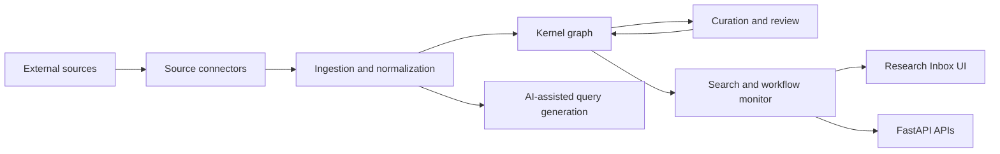

# Artana Resource Library - System Overview

## Purpose

The Artana Resource Library is a domain-agnostic, evidence-first research data platform. It ingests external sources, normalizes them into a kernel graph, and exposes the result through governed workflows for curation, search, monitoring, and downstream analysis.

The system is built for biomedical research first, but the architecture is intentionally source-agnostic. The current implementation is centered on PubMed and ClinVar, while the wider platform pattern is meant to support additional source types over time.

## What The System Is

At a practical level, this is a coordinated stack of:

- a FastAPI backend that owns the core business logic and APIs
- a standalone Research Inbox UI for operators and researchers
- a kernel graph that stores entities, observations, relations, and provenance
- AI-assisted orchestration for query generation, extraction, and graph connection
- background scheduling, run tracking, and cost monitoring
- security controls for authorization, auditability, and PHI-sensitive workflows

The key idea is not "chat with data." The key idea is "turn external evidence into governed, reviewable knowledge that can be reused across research spaces."

## What The System Is Not

This project is not:

- an ELN
- a LIMS
- a clinical data warehouse
- a generic chatbot UI
- a pure model training platform
- a wet-lab execution system

It is an orchestration layer that sits alongside existing systems of record. External tools and repositories remain authoritative; MED13 coordinates the work of ingesting, validating, structuring, and reviewing evidence.

## Core Workflow

The system follows a repeatable flow:

1. A source is connected to a research space.
2. The source is scheduled or manually triggered.
3. Data is fetched from the source connector.
4. AI-assisted query generation may refine the upstream search.
5. Records are normalized, validated, and deduplicated.
6. Structured facts are written into the kernel graph with provenance.
7. Governance rules decide whether results can be auto-approved, need review, or must stay in shadow mode.
8. Operators inspect run traces, timing, and cost summaries in the workflow monitor.

This is not a one-shot ingestion pipeline. It is an ongoing, reviewable research workflow.

## Architecture In One Diagram

## Architecture Layers

### Presentation

The presentation layer consists of:

- FastAPI routes for admin, research space, and workflow endpoints
- the Research Inbox UI
- future public-facing front-door content and conversion flows

The public front door is a separate product surface from the authenticated inbox UI. The Research Inbox is the operational console.

### Application

The application layer orchestrates use cases such as:

- source management
- ingestion scheduling
- ingestion execution
- query generation
- entity recognition
- extraction
- graph connection
- curation and review
- workflow monitoring

These services decide what happens and in what order. They do not contain infrastructure details.

### Domain

The domain layer contains the platform rules and contracts:

- Pydantic domain entities
- repository ports
- agent contracts
- review and governance rules
- kernel concepts such as entities, observations, relations, and provenance

The domain is where the platform defines what must be true, regardless of how the data is stored or which external service is connected.

### Dictionary And Kernel Semantics

The Dictionary is the schema engine that makes the platform domain-agnostic. It defines:

- entity types
- relation types
- variables and constraints
- transform and mapping rules
- review and validity semantics

Incoming source data is interpreted through the Dictionary before it reaches the kernel graph. That is how the system keeps source-specific ingestion logic separate from the platform's core model.

The kernel graph then stores the reviewable result of that interpretation: entities, observations, relations, and provenance tied to a research space.

### Infrastructure

The infrastructure layer provides:

- SQLAlchemy repositories
- PubMed and ClinVar ingestors
- Artana-based agent adapters and model configuration
- scheduling and background workers
- security services such as audit logging, RLS context injection, and PHI encryption
- storage and cost tracking utilities

Infrastructure is replaceable. The domain rules are not.

## Current Source Scope

The current launch connectors are:

- PubMed
- ClinVar

The architecture already allows for other source classes, such as generic APIs, file uploads, database connectors, and web scraping, but those are not currently wired into the live flow.

That matters because it defines the real product boundary today: the platform is already source-agnostic by design, but the shipped connector footprint is still narrow.

## Evidence And Governance

The platform is designed around evidence, confidence, and review:

- agent contracts require confidence, rationale, and structured evidence
- governance thresholds decide whether a result can write immediately
- low-confidence or evidence-poor outputs are routed to human review
- curation actions are explicit and auditable
- run traces preserve what happened during each orchestration attempt

This is the main difference between "LLM demo" software and the system in this repo. The AI layer is constrained by governance and provenance requirements.

## Trust And Safety

The codebase includes several trust primitives:

- row-level security for research-space scoping
- audit logging for mutations and sensitive reads
- direct cost tracking for AI and tool usage
- workflow timing and cost summaries
- review queues with approve/reject/quarantine actions
- explicit fallback behavior when AI-generated output is invalid or unavailable

These controls reduce the chance that a bad model output becomes an unreviewed fact in the graph.

## What Creates Value

The platform creates value in three ways:

1. It reduces manual work by automating repetitive ingestion and normalization steps.
2. It keeps scientific claims linked to evidence and provenance instead of flattening them into opaque summaries.
3. It gives teams a bounded research workspace where data, review, and monitoring live together.

That is a real product pattern, not just a prompt wrapper. But it is also not yet a proven market moat by itself.

## Honest Current Assessment

The strongest thing in the system today is the workflow and governance layer:

- source orchestration
- evidence-first contracts
- review and auditability
- run tracing and cost visibility
- secure, research-space-scoped execution

What the repo does not yet prove is:

- proprietary data advantage
- fine-tuned biological models
- wet-lab validation loops
- distribution power
- a complete sales motion

So the most accurate description is:

> A governed, evidence-first research orchestration platform for biomedical and other structured domains, with a kernel graph at the center and AI used as a constrained assistant rather than as the source of truth.

## Current Product Boundary

Today the system is best understood as:

- a research operations platform for structured evidence
- a kernel graph system for storing reviewable knowledge
- an AI-assisted pipeline for query generation, extraction, and graph connection
- an admin console for curation, monitoring, and control

It is not yet a fully broad platform with a strong commercial moat from distribution or proprietary data. The architecture can support that future, but the codebase alone does not claim it has already arrived.

## Key Implementation Anchors

- `src/routes/`
- `src/application/services/`
- `src/application/agents/services/`
- `src/domain/`
- `src/infrastructure/ingest/`
- `src/infrastructure/llm/`
- `src/background/`
- `src/routes/research_spaces/workflow_monitor_routes.py`
- `src/routes/curation.py`
- `docs/latest_plan_path/datasources_architecture.md`
- `docs/User Experience/ux.md`

## Reader's Guide

If you want to understand the system from different angles:

- start with `docs/system_overview.md` for the product and architecture summary
- use `docs/latest_plan_path/datasources_architecture.md` for the current implementation plan and source model
- use `docs/source_workflow_monitor_and_pipeline_trace.md` for run tracing and observability
- use `docs/EngineeringArchitecture.md` for the broader clean-architecture framing
