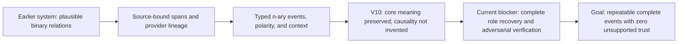

# TG04 V10 Live Scientific Result

## Decision

V10 is an honest scientific failure and must not authorize graph persistence or
a later repeat. The provider-backed run completed, but its receipt-bound verifier
output failed deterministic semantic validation. The gate decision is
`STOP_AND_RECALIBRATE_NESTED_EVENT_EXTRACTION`.

This is not evidence that Artana learned nothing. It is evidence that the current
agent workflow can preserve the main meaning of a biomedical sentence while
still losing graph-critical role structure. That is insufficient for trusted
scientific persistence.

## Frozen Source

The fresh hidden source was:

> Similarly pre-existing iTreg cells did not decrease FOXP3 expression upon
> IL-4 exposure (Figure S3B).

The source, acceptable representation families, selection rule, and prompt
identities were frozen before execution in
`2026-07-18-tg04-v10-source-gold-lineage.md`.

## What The Agents Did

The extractor returned one `DECREASE` event with `NULL_RESULT` polarity. It
preserved:

- the population: `pre-existing iTreg cells`;
- the tested process: `FOXP3 expression`;
- the exposure: `IL-4 exposure`;
- the null direction: the decrease did not occur;
- a non-causal interpretation: it did not invent IL-4 as a proven cause.

It omitted or compressed three graph-useful representation details:

- `FOXP3` as a separate `GENE_OR_PROTEIN/THEME`;
- `FOXP3 expression` as an `OUTCOME/EFFECT`, rather than only a process theme;
- `upon IL-4 exposure` as the complete `TIMEFRAME/CONTEXT`;

It also returned the exact source phrase `did not decrease` where the frozen
matcher expected the shorter `not decrease`. That is scientifically equivalent
and should be classified as benchmark rigidity, not scientific information loss.

The verifier then classified the candidate as `ENTAILED`, `COMPLETE`, and
`ELIGIBLE`. It explicitly claimed the inventory was complete. Deterministic
semantic validation rejected that judgment because the candidate did not
preserve the complete temporal phrase and exposure inside a separate timeframe
role.

## Root Causes

### 1. Meaning and representation are different tasks

Luna understood the broad scientific result. The failure occurred while
projecting that meaning into Artana's typed event contract. A fluent explanation
is therefore not proof of a complete graph event.

### 2. The extraction task asks for too many decisions at once

One call must discover the event, choose a representation family, identify exact
spans, assign biomedical types, assign event roles, preserve polarity, and avoid
causal overreach. The model compressed compatible roles instead of preserving
all material roles.

### 3. The verifier was not adversarially independent enough

The second Luna call checked plausibility but repeated the extractor's framing.
It did not enumerate what a complete alternative representation requires and
did not falsify the candidate against missing roles.

### 4. Natural-language instructions are weaker than an executable contract

The prompts already mention temporal completeness. V10 shows that mentioning a
rule is not the same as reliably applying it. The deterministic validator caught
the miss, but the workflow had no agent correction stage after that categorical
failure.

### 5. One benchmark rule was too surface-specific

Exact cue equality treated `did not decrease` and `not decrease` as different.
The V10 score remains frozen and cannot be changed after seeing the output, but
future protocols must pre-register source-anchored cue equivalence separately
from scientific role completeness.

### 6. The audit harness assumed only valid agent outputs could be terminal

Both provider calls were completed and independently receipt-verified, yet the
sequence finalizer rejected the report because `verification` was null after the
semantic error. The run was consumed but remained `EXECUTING`. That is an audit
integrity defect, separate from the scientific defect.

## Immutable Execution Evidence

- Run: `tg04-v10-live-20260718`
- Repeat: `1`
- Model: `openai/gpt-5.6-luna`
- Repository commit: `26c63e1b0d0ebee3804383c01ab7283b4e9700d2`
- Internal canonical report SHA-256:
  `a1347ca7588d7b1b83629f74406cadb294f65c091659daa64011b1d815018005`
- Serialized report-file SHA-256:
  `39195840d915da661b84a44dacd800fb65e4669f81d68439d6dbefef2f0f79d9`
- Execution lease SHA-256:
  `5efaaa4471230f9a4fd0b23c7181f44129c6eb135fe213e3567fab705fd6d159`
- Provider calls: `2`
- Live verified receipts: `2`
- Primary extraction outcome: `accepted`
- Weak-review outcome: `semantic_invalid`
- Terminal error: `StructuredModelSemanticError`
- Gate requirements: `21` true, `9` false
- Trusted candidates: `0`
- Persistence authorized: `false`
- Deterministic fallback available: `false`

The report's terminal semantic failure replays offline from its stored raw
provider payload. V10 must not be rerun. Its repeat slot is consumed.

## Progress Interpretation

Operational safety and information preservation have moved forward. Scientific
qualification has not crossed the goal line because complete-event recovery is
still not repeatably demonstrated on fresh hidden units.

## Remediation Plan

### PR 1: Honest terminal failure sealing

Add a separate `TERMINAL_FAILURE` finalization path. It must require a consumed
execution lease, immutable report identity, receipt-bound attempts, live receipt
reverification, a reproducible categorical semantic failure, and a false gate.
It must never authorize a later repeat.

Acceptance:

- the exact V10 semantic error replays from raw provider output;
- tampered error categories, payloads, receipts, or gates fail closed;
- a terminal failure cannot unlock repeat 2;
- successful finalization remains unchanged.

### PR 2: Agent projection-normalization protocol

Separate source-level scientific reading from graph projection. Preserve the
original extraction, then ask a dedicated agent to choose `DIRECT`, `NESTED`, or
`ABSTAIN` and return one complete source-bound representation. Do not add or
repair scientific content deterministically. The projection prompt must require
all material roles, exact spans, and a falsification explanation.

Pre-register exactly three possible calls:

1. extractor;
2. constrained projection-normalization agent;
3. independent verifier over the normalized candidate and untouched source.

Acceptance:

- original and normalized outputs both remain in the audit trail;
- no deterministic extraction fallback or content synthesis exists;
- the normalizer cannot promote itself;
- all calls have provider receipts and categorical outputs.

### PR 3: Fresh V11 falsification trial

Select one content-blind fresh hidden unit from the frozen corpus, excluding all
V1-V10 documents. Use a different article containing a negated directional
event, named gene/protein, expression process, explicit exposure and temporal
context, but no causal verb. Freeze the source, gold event families, cue
equivalence rules, prompts, schemas, model, call topology, and stop/go gate
before execution.

V11 passes only if:

- every material participant and context role is preserved;
- polarity, direction, and uncertainty are correct;
- no unsupported causal edge is introduced;
- the verifier independently finds no missing role;
- exactly one complete acceptable representation family is recovered;
- all unmatched valid claims remain review-only;
- provider lineage is complete and no fallback is credited.

### PR 4: Repeatability qualification

Only after V11 passes, run two more pre-registered fresh hidden units from the
same frozen implementation. Any failure stops the sequence and starts a new
root-cause cycle. Three passes are the minimum evidence for this narrow event
class; they are not a universal biomedical-quality claim.

## Stop/Go Rule

Continue the normalization strategy only if V11 recovers a complete event without
new unsupported claims. Stop and reconsider the ontology or model/task split if
the normalization agent still omits roles, if the verifier again approves an
incomplete candidate, or if invention increases. A stronger model may then be
tested on the same frozen protocol, but it must beat the failure categorically;
self-reported numeric confidence is not evidence.
