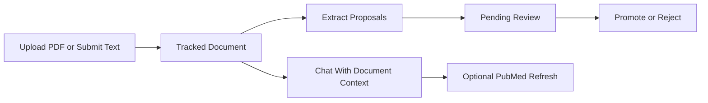

# Full Research Workflow

This is the easiest way to understand what `artana_evidence_api` does.

If you are new, start here before reading the full API reference.

## What This Service Does In Plain English

The service helps you do four things:

1. bring in evidence
2. extract possible facts from that evidence
3. review those facts manually
4. ask grounded questions with the reviewed and staged context

The important rule is:

- the service can suggest graph facts
- it does not write them straight into the graph automatically
- a human still promotes or rejects them

## The Simple Flow



## The Three Shortest Paths

Choose one:

- review one document if you want safe manual control
- ask with one document if you want the shortest assistant-first experience
- search PubMed directly if you want literature discovery without documents
- search MARRVEL directly if you want gene-centered discovery without starting
  from your own documents

If you are scripting the API from Python, call the same HTTP routes with
`httpx` or `requests`. The matching route families are:

- `POST /v1/spaces/{space_id}/documents/text`
- `POST /v1/spaces/{space_id}/documents/pdf`
- `POST /v1/spaces/{space_id}/chat-sessions/{session_id}/messages`
- `POST /v1/spaces/{space_id}/pubmed/searches`

If your space is brand new and you want the service to guide setup before you
start reviewing evidence, the newer setup endpoints are:

- `POST /v1/spaces/{space_id}/agents/research-onboarding/runs`
- `POST /v1/spaces/{space_id}/research-init`

## What The Main Terms Mean

- `document`: one uploaded PDF or text note tracked by the service
- `proposal`: a suggested fact that still needs human review
- `promote`: accept a proposal and write the reviewed outcome to the graph
- `reject`: keep the proposal out of the graph
- `chat session`: a conversation that can use graph state, memory, and documents
- `PubMed job`: a saved literature search you can inspect later

## Text Versus PDF

Text workflow:

- submit the text
- extract staged work directly
- review the staged output

PDF workflow:

- upload the PDF first
- extraction runs enrichment to pull text out of the file
- that enriched text is then used for proposal staging

This means PDF upload alone does not immediately create proposals. The
`/extract` call is the point where enrichment and proposal staging happen.

## Use Case 1: Review One Paper

Goal:

- upload one paper
- extract possible facts
- review the staged queue items

Upload the PDF:

```bash
curl -s "$HARNESS_URL/v1/spaces/$SPACE_ID/documents/pdf" \
  -H "Authorization: Bearer $TOKEN" \
  -F "file=@./med13.pdf" \
  -F "title=MED13 paper"
```

Run extraction:

```bash
curl -s "$HARNESS_URL/v1/spaces/$SPACE_ID/documents/<document_id>/extract" \
  -H "Authorization: Bearer $TOKEN" \
  -X POST
```

List the document-scoped review queue:

```bash
curl -s "$HARNESS_URL/v1/spaces/$SPACE_ID/review-queue?document_id=<document_id>" \
  -H "Authorization: Bearer $TOKEN"
```

Act on one queue item:

```bash
curl -s "$HARNESS_URL/v1/spaces/$SPACE_ID/review-queue/<item_id>/actions" \
  -H "Authorization: Bearer $TOKEN" \
  -H "Content-Type: application/json" \
  -d '{
    "action": "promote",
    "reason": "Reviewed and approved",
    "metadata": {}
  }'
```

What to expect:

- PDF upload creates a tracked document record
- extraction creates staged `pending_review` proposals
- every queue item stays linked to the originating document and run
- PDFs gain enrichment details only after extraction completes

For genomics-capable documents, those staged proposals are variant-aware:

- exact variant entities can be staged as first-class `entity_candidate`
  proposals
- structured observations such as transcript, classification, zygosity, or
  exon can be staged separately
- phenotype and mechanism output stays rooted on the variant instead of being
  flattened immediately into generic relation-only language
- incomplete extraction becomes an explicit review item instead of silently
  downgrading the claim

## Use Case 2: Ask A Question With One Document

Goal:

- attach one document to a chat question
- get a grounded answer
- optionally stage graph-write proposals from the chat result

First upload or submit the document.

Then create a chat session:

```bash
curl -s "$HARNESS_URL/v1/spaces/$SPACE_ID/chat-sessions" \
  -H "Authorization: Bearer $TOKEN" \
  -H "Content-Type: application/json" \
  -d '{
    "title": "MED13 document chat"
  }'
```

Send the message with the tracked `document_id`:

```bash
curl -s "$HARNESS_URL/v1/spaces/$SPACE_ID/chat-sessions/<session_id>/messages" \
  -H "Authorization: Bearer $TOKEN" \
  -H "Content-Type: application/json" \
  -d '{
    "content": "What does this document suggest about MED13 and cardiomyopathy?",
    "document_ids": ["<document_id>"],
    "refresh_pubmed_if_needed": true
  }'
```

If the answer is verified and you want reviewed graph changes, stage generic
proposals from the chat result:

```bash
curl -s "$HARNESS_URL/v1/spaces/$SPACE_ID/chat-sessions/<session_id>/proposals/graph-write" \
  -H "Authorization: Bearer $TOKEN" \
  -H "Content-Type: application/json" \
  -d '{
    "candidates": null
  }'
```

Then review those staged items through the review queue:

```bash
curl -s "$HARNESS_URL/v1/spaces/$SPACE_ID/review-queue" \
  -H "Authorization: Bearer $TOKEN"
```

## Use Case 3: Search PubMed Directly

Goal:

- run a saved literature search
- inspect preview results
- reuse that search result later

Start the search:

```bash
curl -s "$HARNESS_URL/v1/spaces/$SPACE_ID/pubmed/searches" \
  -H "Authorization: Bearer $TOKEN" \
  -H "Content-Type: application/json" \
  -d '{
    "parameters": {
      "gene_symbol": "MED13",
      "search_term": "MED13 cardiomyopathy",
      "max_results": 25
    }
  }'
```

Fetch the saved job:

```bash
curl -s "$HARNESS_URL/v1/spaces/$SPACE_ID/pubmed/searches/<job_id>" \
  -H "Authorization: Bearer $TOKEN"
```

## Which Path Should I Use?

Use documents plus proposals when:

- you already have a PDF or text note
- you want manual review before anything reaches the graph

Use chat when:

- you want a grounded answer in plain language
- you want to combine graph context with one or more tracked documents

Use PubMed when:

- you want fresh literature directly
- you want a saved search job with preview results

Use MARRVEL when:

- you want gene-centered cross-resource discovery
- you want structured background around a gene or variant before a broader run

Use research bootstrap, schedules, mechanism discovery, or supervisor when:

- you are moving beyond one document or one question
- you want larger multi-step research workflows

## Beginner Rules Of Thumb

- start with one document, not a whole project
- use the review queue as the default manual review gate
- treat chat as a grounded assistant, not an auto-write path
- turn on PubMed refresh when you want fresh literature added to a chat answer
- move to bootstrap or supervisor only after the single-document flow feels
  clear
